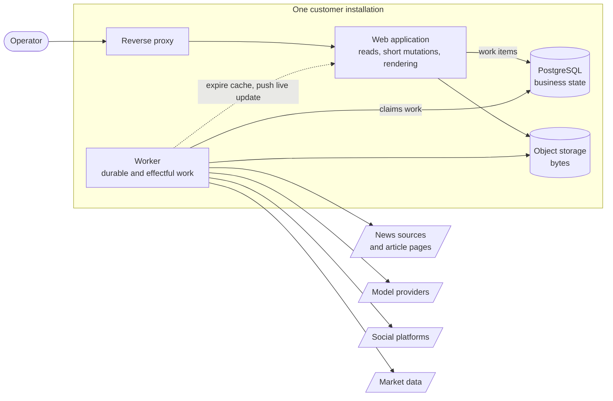

# Architecture

These pages describe the system from the outside in. Read them in order the first
time; afterwards use them as reference.

| Page | Question it answers |
|---|---|
| [System context](system-context.md) | Who uses this and what does it talk to? |
| [Containers](containers.md) | What are the deployable pieces and how do they communicate? |
| [Web application](web-application.md) | How is the operator application organised internally? |
| [Worker application](worker-application.md) | How is durable work organised and executed? |
| [Caching and realtime](caching-and-realtime.md) | How does a screen stay both fast and current? |
| [Security](security.md) | What is trusted, what is validated, and where do secrets live? |
| [Observability](observability.md) | What is recorded when something goes wrong, and what is never recorded? |
| [Key decisions](key-decisions.md) | Which constraints are deliberate, and why? |

## The shape in one picture

## The four ideas everything else follows from

**One installation, one customer.** Not multi-tenant. This removes cross-tenant
isolation, billing and quota from the design entirely, and it is why secrets can
live in the environment rather than in a vault.

**The request path is short.** The web application reads, renders, and accepts
short mutations. Anything that fetches, generates, uploads or publishes is handed
to the worker, where it can be retried, observed and reconciled.

**PostgreSQL is the handoff.** Work is enqueued in the same transaction that
records the intent, so a crash between "the operator asked" and "the work
started" is impossible. The worker claims from there.

**Effects are reconciled, never assumed.** A publish that returns ambiguously is
recorded as ambiguous and resolved later against provider evidence — not guessed
at, and not silently retried into a duplicate post.
