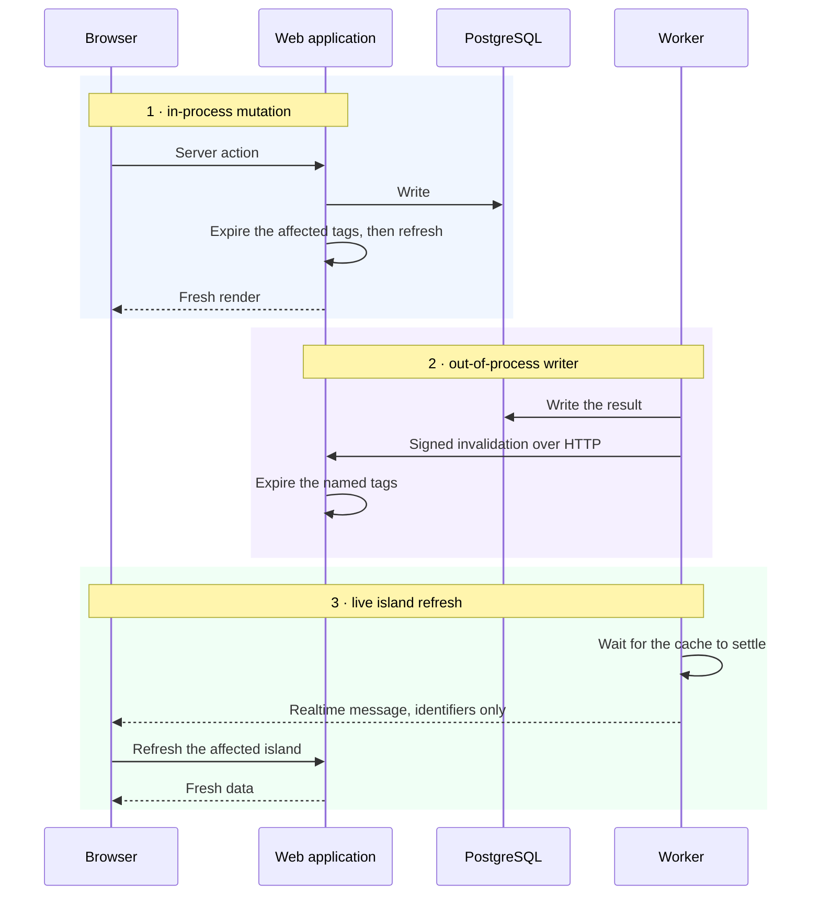
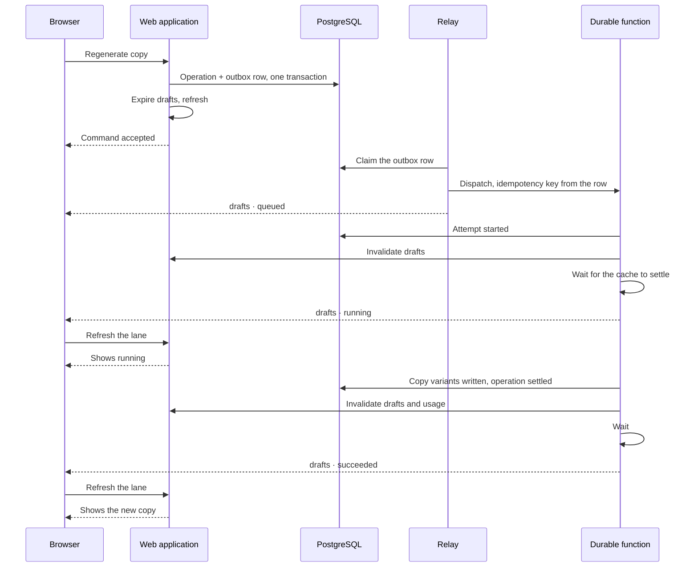

# Caching and realtime

How a screen is both fast and current, when the work that changes it happens in a
different process.

## The problem

Almost every screen re-reads the same rows across navigations, so reads should be
cached. But the writer is usually the worker, in another process, which cannot
call the framework's invalidation API. And a durable operation takes seconds to
minutes, so the operator needs to see progress without polling.

Three mechanisms solve that. They are numbered here so the rest of the documentation can refer to them.



## Cached reads

**A read of customer-owned data is a cached kernel by default.** Leaving one
dynamic is the choice that needs a stated reason.

Every cached read has the same shape, and it is uniform enough to be a rule:

```
export async function getX(...) {          // exported wrapper — uncached
  const session = await requireSession();  // authentication
  const workspaceId = await resolve(...);  // installation resolution
  return readCachedX(workspaceId, session.user.id, ...);
}

async function readCachedX(workspaceId, userId, ...) {   // private
  "use cache";
  cacheLife("minutes");
  cacheTag(...);
  // the database read
}
```

Authentication and installation resolution happen **outside** the cache boundary,
always. Request-scoped values stay outside too. Only the database read is cached,
and its arguments are the cache key.

There are **21 cached kernels** today: 17 operator-scoped and 4 workspace-shared.
Twenty use a minutes lifetime; the installation overview uses hours, because
configuration changes at deploy time rather than during a session.

### Operator-scoped versus workspace-shared

**Operator-scoped** kernels take the user identifier as a parameter, so it is part
of the cache key. That is the default: an operator's drafts, activity, saved
cards, history, market analyses and usage.

**Four are deliberately workspace-shared**: the installation overview and the
three source reads — the catalogue, the import ledger and the item stream. Every
operator in an installation is looking at the same source desk, so caching it per
operator would multiply identical entries for no benefit.

### The rule that makes this safe

**A cache tag is an invalidation group, never a visibility channel.**

Isolation lives in the cache **key** and in the SQL predicate. Tags are
per-installation groups over a closed set of entities: installation, sources,
usage, editorial, drafts, publishing, market analysis.

Getting this backwards — using tags to separate operators — would mean one
operator's invalidation could serve another operator's rows. The key/tag
distinction is the whole safety argument, which is why every kernel takes the user
identifier as an argument rather than baking it into a tag.

### The one uncached getter

The session getter. It uses request-level deduplication rather than the data
cache, because a session read must reflect the current request. The operations
slice has no cached read module at all — it is live data over a realtime channel,
which a tag invalidation would never reach.

## 1 · In-process mutations

A server action wraps a router procedure and, after it settles, expires the
affected tags and triggers a refresh.

Refresh failures are **swallowed into a log** rather than propagated. A mutation
that succeeded must not be reported as failed because the subsequent refresh did
not land — the write is the truth, and the screen will catch up.

## 2 · The out-of-process writer

The worker cannot call the framework's invalidation API. So it POSTs a signed
request naming the tags to expire.

**Authentication.** HMAC-SHA256 over the timestamp and the raw body, constant-time
comparison, and a maximum clock skew that makes a captured request unreplayable
outside its window.

**Fails closed.** With no secret configured, the route returns a service-
unavailable status rather than accepting anything.

**Bounded twice.** The declared content length and the actual body size are both
checked.

**Confirmed per tag.** The response reports each tag and whether it was
revalidated, and the sender only reports success when *every* requested tag came
back in order and confirmed. A 200 is not taken as agreement.

Entries are expired rather than merely marked stale, because a push-driven refresh
follows immediately — the next read must block on fresh data instead of serving
the stale entry that a softer expiry would leave behind.

Two things worth stating plainly:

- **"Internal" is a deployment property, not a check the route performs.** It
  verifies the signature; the reverse proxy keeps it off the public internet by
  returning `404` for that path.
- **It is cache durability only, never business truth.** The worst case for a
  lost invalidation is stale reads until entries expire on their own.

The invalidation is best-effort from the worker's side and returns one of four
outcomes — accepted, disabled, rejected or failed. **Disabled is not an error**: an
installation that has not configured the pair simply does not make the call.

Inside a durable function, though, a *failed* or *rejected* invalidation throws so
the step retries. Losing an invalidation is a retryable failure there, not a
warning.

## 3 · Live updates

Realtime channels carry **identifiers, not content**. A message says what changed;
the browser re-reads through the normal authorized, cached path.

That is what stops a channel becoming a way to receive data you are not permitted
to read.

| Channel | Scope | Carries |
|---|---|---|
| `operations` | Installation-wide | Operation identifier, actor, lifecycle, version |
| `publishing` | Per operator | Operation, publication, schedule identifiers |
| `usage` | Per operator | A timestamp |
| `sources` | Installation-wide | A timestamp |
| `editorial` | Per analysis run | The run identifier |
| `drafts` | Per analysis run | Run, draft, operation identifiers and a change code |
| `market analysis` | Per analysis | The analysis identifier |

**The operations channel is installation-wide, so every message carries its own
audience** — the operator it belongs to, or a shared flag for work everyone may
see, such as a source import. The client filters; the channel does not.

Publishing and usage are addressed per operator by channel name instead, because
every one of their rows is owned by the operator who created it.

The entity channels repeat their identifier inside the message so an island can
drop a message arriving on a socket it has not torn down yet.

### The ordering invariant

**Invalidate the cache, wait for it to settle, then publish the message. Never the
reverse.**

A client woken by a message immediately re-reads. If the message arrived first, it
would read the stale entry and show nothing new — and then sit there, because no
second message is coming.

Inside a durable function the wait is a durable sleep. Outside one it is a plain
delay. And when the invalidation was not accepted, **no message is published at
all** — waking a client to read stale data is worse than not waking it.

Publishing a realtime message is itself best-effort: a failure is logged and
swallowed, so a realtime outage never fails a durable step.

### Tokens

The browser subscribes with a narrow token minted server-side: one channel, the
named topics, and nothing else. The signing key never leaves the server.

**Realtime is optional.** With neither the development flag nor a signing key
configured, the minter returns an unavailable status, and the interface degrades
to a manual refresh button rather than erroring. That is a supported
configuration.

### Coalescing

A burst of messages does not produce a burst of refreshes. The freshness hook runs
a small state machine: a message while idle starts a refresh; a message while
refreshing marks a trailing refresh; settling drains the trailing state exactly
once.

Reconnects are handled separately. A connection dropping latches a catch-up flag,
and coming back fires exactly one catch-up refresh — because messages sent while
disconnected are gone.

The subscription effect reads its callbacks through the "effect event" primitive,
so changing props never tears down and rebuilds the connection.

## Putting it together

A copy generation, end to end:



Every arrow back to the browser carries identifiers. Every re-read goes through
the ordinary authorized path.

## Adding a cached read

1. Put it in `features/<slice>/api/server/get-*.ts`.
2. Do authentication and installation resolution in the exported wrapper.
3. Put `"use cache"` on a **private** kernel taking the installation identifier and
   — unless the read is deliberately shared — the user identifier as arguments.
4. Choose a lifetime. Minutes is the default; hours is for configuration.
5. Add the tag to the slice's tag module, using the shared builder.
6. Name all three refresh paths explicitly: which mutation expires it, whether the worker
   invalidates it, and which island refreshes on a live message.

Step 6 is the one that gets skipped, and skipping it produces a screen that is
correct on first load and quietly stale forever after.

## One current limitation

A second replica of the web application would need a shared cache handler first.
The invalidation call reaches one instance, so with two replicas the other would
keep serving its own cached entries until they expired on their own.
