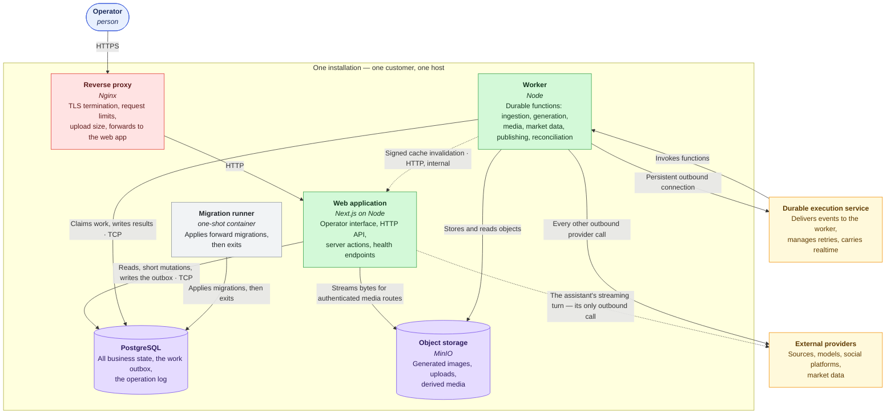
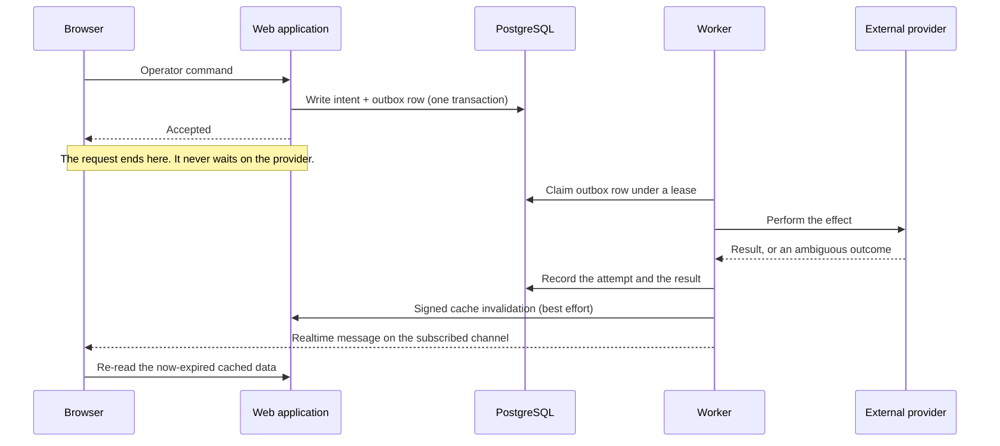

# Containers

The deployable pieces inside one installation, and how they talk to each other.

The dashed edges are the two best-effort ones: cache invalidation may fail
without making anything incorrect, and the assistant's turn is the single
exception to "all outbound calls leave from the worker".

## The pieces

### Reverse proxy

Terminates TLS, enforces request limits and body size, and forwards to the web
application. It is also where abuse protection lives: there is no third-party
protection dependency in the codebase, so the proxy's own per-address rate-limit
zones — one general, one much stricter on the authentication paths — are the
first line, with the sign-in throttle and per-procedure authentication behind
them.

### Web application

Next.js on Node. Serves the operator interface, the HTTP API, the authenticated
media routes, the health endpoints, and the internal cache-invalidation
endpoint.

It reads from PostgreSQL directly through cached server-side reads. It writes
only short mutations — and when a mutation needs durable work, it writes the
intent and the work item in the same transaction and returns.

**It makes exactly one kind of outbound provider call**: the operator assistant's
streaming turn. That exception is named here so it stays the only one. Everything
else that leaves the installation leaves from the worker.

Two health endpoints, and they mean different things:

- `GET /api/health` is static, does no input or output, and proves only that the
  process answers. Suitable for a restart probe.
- `GET /api/health/ready` is dynamic. It runs a bounded database check *and*
  compares the template this process loaded against the one applied to the
  database. It returns a generic `503` that names no driver, host or cause.

### Worker

A plain Node process. It owns every durable and effectful operation: source
ingestion, article enrichment, editorial analysis, copy generation, image
generation and composition, market data and rendering, media verification,
storage reconciliation, scheduling and publishing.

It has two validated modes. **`durable`** is the real thing. **`health-only`**
starts the health server and nothing else — no template load, no database
connection, no durable connection — which is what lets a host answer a probe
while the installation is being prepared.

The worker connects *outbound* to the durable-execution service and receives
function invocations over that connection. It exposes no inbound port except its
own health server, and the health check is what a container orchestrator uses to
decide whether it is ready.

Readiness for the worker proves five things in one request: PostgreSQL is
reachable; exactly one workspace row exists and its template key and fingerprint
match this artifact's loaded template; the object store answers a list within its
timeout; the durable connection is active; and the outbox relay is accepting
work. Draining is reported distinctly from starting, so a load balancer can drain
before the process exits.

### PostgreSQL

All business state, plus two things worth calling out:

- **The outbox.** A work item is written in the same transaction as the state
  change that caused it, so "the operator asked" and "the work was enqueued"
  cannot diverge.
- **The operation log.** Every durable operation and every attempt, including
  ambiguous ones.

The version floor is not incidental: the schema uses the built-in time-ordered
UUID function for primary keys, which arrived in PostgreSQL 18. The exact image
tag is in `docker-compose.yml` and in the production compose file.

### Object storage

MinIO, S3-compatible, behind one seam in `packages/storage`. It holds generated
images, operator uploads and derived media.

The browser never talks to it. There are no presigned upload URLs handed to the
client and no direct reads. Bytes reach the browser only through authenticated
routes on the web application, which stream them. The database owns every
object's lifecycle state — pending, uploaded, validating, verified, rejected,
expired — so an orphan is detectable and reconcilable.

### Migration runner

A one-shot container built from the database package. It applies forward
migrations and exits. Both applications depend on it having completed
successfully, so nothing starts against an unmigrated schema.

### Durable execution service

Delivers events to the worker, manages retries, and provides the realtime
channels the operator interface subscribes to. Locally it runs as a development
server alongside the worker.

## How work flows between them

Three properties fall out of that shape:

**A crash between the intent and the work is impossible**, because they are one
transaction.

**Cache invalidation is best-effort and may fail**, and the system is still
correct if it does. Entries expire on their own schedule; freshness is a nicety,
and the database write is the truth. The worker never fails its own operation
because it could not reach the web application.

**Realtime carries identifiers, not content.** A message says what changed; the
browser re-reads through the normal authorized, cached path. That is what keeps
a channel from becoming a way to receive data you are not permitted to read.

## The local stack

`docker-compose.yml` at the repository root brings up the same shape on a
laptop.

| Service | Purpose | Notes |
|---|---|---|
| `postgres` | PostgreSQL | Published on loopback only |
| `minio` | Object storage | API and console, both on loopback |
| `minio-init` | Creates the bucket | One-shot |
| `migrate` | Applies migrations | Runs to completion before web or worker start |
| `web` | The web application | Loopback port 3001 |
| `worker` | The worker | Behind a profile, so it is opt-in |

Every published port binds to `127.0.0.1`. Nothing in the local stack is exposed
to the network by accident.

The password variable has no default and the file uses the fail-if-unset form, so
Compose refuses to start rather than quietly bringing up a database with a blank
password.

`CUSTOMER_TEMPLATE_KEY` is passed as both a build argument and a runtime
variable, and it is deliberately allowed to interpolate as empty rather than
failing there — because the Dockerfile and the prestart gate both reject an empty
or mismatched key with a clear message, which is a better error than a Compose
interpolation failure.

## Next

- [`web-application.md`](web-application.md) — inside the web application
- [`worker-application.md`](worker-application.md) — inside the worker
- [`../operations/deployment.md`](../operations/deployment.md) — how this is
  actually deployed, and in what order
