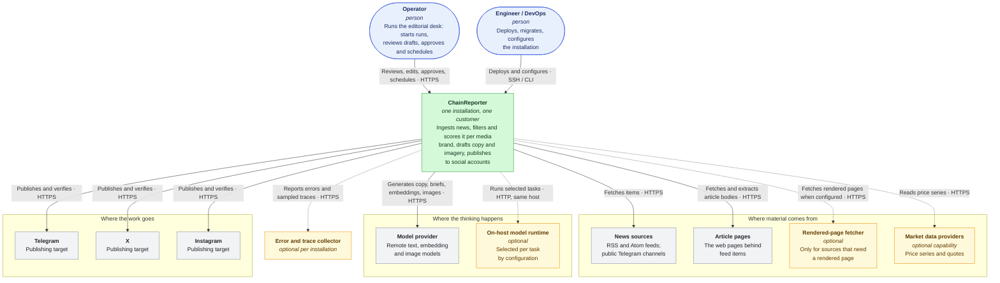

# System context

What ChainReporter is, who uses it, and every system it depends on. This is the
outermost view — one installation, serving one customer.

A solid arrow is a dependency the product always has. A dashed arrow is one that
exists only when an installation is configured for it, and every dashed box is
optional — the application has to run correctly with all of them absent.

## The people

**Operators** are the only kind of user account, and there is no way to become
one from the outside — no signup route exists. Accounts are created from the
command line when the installation is provisioned. An operator does editorial
work: starting runs, working the board, editing drafts, approving, scheduling,
and resolving anything the system could not resolve itself.

**Engineers** never appear as an application user. They deploy, migrate, apply
the customer template and bind secrets, all through commands and environment
files on the host.

There is no administrator role separate from the operator, and no customer-facing
self-service surface at all.

## What the system depends on

### Required

| System | What it is used for | If it is down |
|---|---|---|
| **News sources** | The RSS and Atom feeds, and public Telegram channels, a customer's template declares | Imports record a per-source failure with its reason; other sources still import |
| **Article pages** | The bodies behind feed items, fetched and extracted directly over HTTP | Enrichment records `failed` or `unknown`; the item still flows through with feed content |
| **Model provider** | Copy generation, editorial briefs, keyword embeddings, image generation, translation, the operator assistant | Generation operations fail retryably; nothing is silently degraded |
| **Publishing platforms** | Telegram, X and Instagram, per the destination accounts a template declares | Publishing attempts record an outcome — including `ambiguous`, which routes to reconciliation rather than a retry |

### Optional

| System | Used when | Absence is |
|---|---|---|
| **Rendered-page fetcher** | A source is configured to need one, because its article pages do not render usefully without JavaScript | Fine — direct fetching is the default |
| **On-host model runtime** | A task's configuration selects it. Image template selection prefers it; embeddings may use it | Fine — the remote provider serves those tasks |
| **Market data providers** | The installation enables the market capability | Fine — the capability is off and the routes do not exist |
| **Error and trace collector** | A collector endpoint is configured | Fine — structured logs fall back to standard output |

"Optional" here is a hard engineering requirement, not a hope. A customer may or
may not have bought an account for these, so no module may treat one as an
assumed dependency. The application has to run correctly with none of them
present.

## What the system deliberately does not depend on

- **No product analytics.** No analytics vendor, module or key exists. Nothing
  about operator behaviour leaves the customer's host.
- **No identity provider.** Email and password, handled in-process.
- **No payment processor.** There is no commercial relationship inside the
  product.
- **No shared control plane.** Installations do not know about each other and
  there is nothing coordinating them.
- **No external document or spreadsheet as a record.** The database is the record
  and the operator screens are the report.
- **No second remote model provider.** One remote backend, plus the optional
  on-host runtime.

## Trust boundaries

Everything outside the installation is untrusted input, including responses from
services the system chose to call.

- **Feed and page content** is data, never instruction. It is parsed with a real
  XML parser and a real HTML parser, never a regular expression, and never
  evaluated.
- **Every outbound fetch** whose URL is influenced by configuration or content
  goes through a single request guard: a protocol allowlist, private and loopback
  address blocking with the address re-checked on every redirect hop, a redirect
  limit, a deadline, a decoded-size cap and a content-type allowlist.
- **Provider responses** are validated against schemas before they reach domain
  code. A model's structured output is parsed, not trusted.
- **Provider errors** never reach the browser or a log verbatim, because they
  routinely contain request URLs and occasionally credentials.

The detail is in [`security.md`](security.md).

## Next

[`containers.md`](containers.md) opens the box: the deployable pieces inside one
installation and how they talk to each other.
