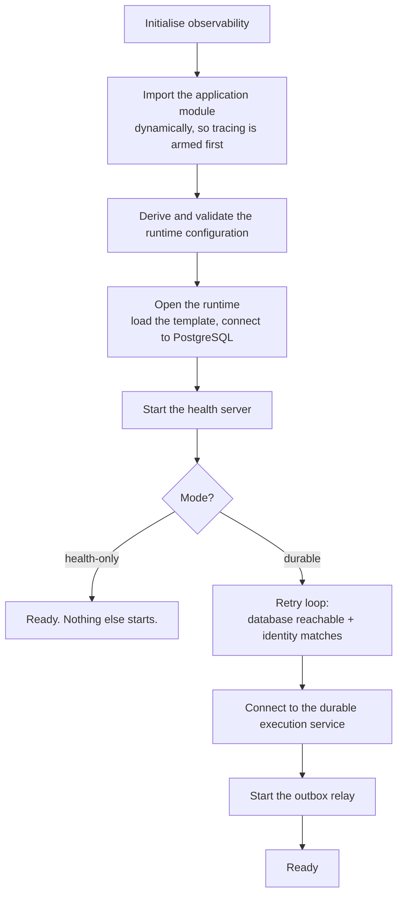

# The worker application

A plain Node process that owns every durable and effectful operation. No inbound
port except its own health server.

## Startup

The application module is imported **dynamically, after** observability is
initialised, so tracing and error reporting are armed before any worker module is
evaluated.

**The health server starts before the dependency checks**, so a host can get an
answer while the installation is still being prepared.

**The dependency loop retries rather than exiting.** A database that is not up yet
is a normal condition during a deploy. It logs each distinct failure code **once**
rather than every second, and logs again on recovery.

### Two validated modes

**`durable`** is the real thing. It additionally requires an immutable application
version — and refuses the literal `dev` in production, because a mutable version
makes "what is running" unanswerable and breaks the deployment identity the
durable service keys on.

**`health-only`** starts the health server and nothing else: no template load, no
database connection, no durable connection. It is what the deployment's one-shot
binding step runs under, so the environment validates without requiring durable
credentials.

### Capabilities

Readiness is reported as four capabilities rather than a single boolean:

| Capability | States |
|---|---|
| Event dispatch | active, disabled, draining, starting |
| Function execution | active, closing, connecting, disabled, reconnecting |
| Model backends | active, disabled |
| Object store | active, disabled, unbound |

Ready means: not draining, the durable connection is active, the relay is
accepting, and the object store is bound. The breakdown is in the response, so a
failing probe usually identifies its own cause without anyone opening a log.

### Graceful drain

Signal handling is owned by the application, not by the SDK — the connect call is
explicitly configured to install no handlers of its own, because the drain order
matters:

1. Flip the health endpoint to unavailable **immediately**, and abort
   initialisation.
2. Await initialisation. Never tear down a half-built runtime.
3. Stop the relay taking new work and drain it.
4. Close the durable connection and wait for it.
5. Close the health server.
6. Close the database.

Each stage is individually caught, so one failure cannot skip the rest. The whole
sequence races a deadline; on timeout it logs, reports, and exits.

**Draining is reported distinctly from starting**, so a load balancer can drain a
process before it exits rather than seeing it as merely unhealthy.

## The durable execution model

The worker is a **connect worker**: it dials out and receives function
invocations over that connection. There is no serve endpoint and no inbound HTTP
surface besides health.

### Events

Every payload carries a schema version and the installation identifier, validated
by a strict schema. There are nineteen event types; **seventeen are relayed from
the outbox** and two are worker-internal, sent by a function to itself.

Each relayed event's identifier is derived from the outbox row. That identifier is
the **end-to-end idempotency key**: an at-least-once relay produces at most one
function run per row.

A malformed row — unsupported version, unknown type, invalid payload — is
**terminal**, not retried. Eight attempts at something that will never parse is
eight wasted attempts.

### The function registry

Roughly thirty functions across nine pipelines: source import, editorial analysis,
copy generation, image generation, translation (two kinds), market verification
and catalogue refresh, market chart rendering, market poster generation, media
verification, storage reconciliation, and publishing.

Nearly every function's first step re-verifies the applied template identity and
throws a non-retriable error on an installation mismatch. That check is cheap and
it closes the window where a worker keeps executing against a database that has
been reconciled to a different configuration underneath it.

**The diagnostic probe function is registered only in development.** It does not
exist in a production deployment.

### Parent and unit functions

Most pipelines are a parent that plans and fans out, plus unit functions invoked
per work item. That split exists so concurrency can be limited per unit while the
parent stays a single coordination point.

Concurrency limits come from **customer-template configuration** where the right
value is customer-dependent — the editorial fan-out concurrency, for example — and
from constants where it is not.

Source-import units carry **two** concurrency keys: a bulk limit at account scope,
and a per-host limit. One slow host cannot starve the others, and the installation
as a whole cannot flood any of them.

### Cancellation is a durable settlement, not a stop

A cancelled run cannot execute more steps — which means it cannot write its own
terminal state. So every cancellable function registers a **sibling** triggered by
the cancellation system event, filtered to that function.

The sibling writes the terminal database state and emits the live message. Without
it, a cancelled run would leave a row stuck in `running` forever.

Each sibling re-validates its envelope and, on a parse failure, logs and returns
rather than throwing — a malformed cancellation event must not itself become a
retrying failure.

### Timeouts and retries per pipeline

Retry counts and finish timeouts are set per function, not globally. The two worth
knowing:

- **The publishing provider effect has zero retries.** A failure there is a
  settlement, not something to try again — that is the whole design of the
  publishing port.
- **Market generation gets the longest finish timeout**, because image generation
  and composition genuinely take minutes.

## Ports and adapters

Every external dependency sits behind a narrow port with a factory. Callers name a
capability; they never learn which adapter ran.

| Port | Adapters |
|---|---|
| Source fetcher | Feed, public channel |
| Article fetcher | Direct HTTP, rendered-page service |
| Market data | Five distinct capabilities |
| Publisher | Telegram, X, Instagram |
| Storage | The object-store seam |
| Model gateway | Remote provider, on-host runtime |

That shape is what makes adding a platform a contained change, and it is why the
editorial pipeline contains no provider names.

## The outbox relay

The bridge from PostgreSQL to durable execution.

Rows are claimed under a lease attributable to one live worker process, dispatched
concurrently, and marked. Losing the lease mid-flight is detected and logged
rather than producing a double dispatch.

**A batch collapses into one live message per audience.** Five events for one
operator produce one update, not five.

Beyond dispatch, the relay runs three repair passes on a scan interval:

**Stranded publication recovery** — publications that lost their claim.

**Follow-up repair** — the case where the effect succeeded but the bookkeeping
after it did not: the activity record, or the cache notification. Both retry under
idempotency keys, so the repair cannot double-write. A cache notification is only
considered complete when invalidation was accepted *and* the live message
published — or when invalidation is disabled entirely, which is a supported
configuration.

**Market catalogue refresh**, when the installation enables that capability, with
an adaptive re-check interval that follows what the catalogue reported.

The loop never dies. Any thrown error logs a stable code and sleeps.

## Cache invalidation and live updates

The worker tells the web application which cache tags to expire, then publishes a
live message. **Always in that order** — see
[`caching-and-realtime.md`](caching-and-realtime.md).

Inside a durable function a failed invalidation **throws**, so the step retries.
Outside one it is logged. Losing an invalidation inside a durable step is a
retryable failure; losing one in the relay is not worth failing the dispatch over.

Publishing a live message is best-effort in both cases: a realtime outage never
fails a durable step.

Cache invalidation is configured as an **optional pair** — a base URL and a
secret. The worker reports at startup whether it is enabled, disabled, or
misconfigured with only one half present.

## Packaging

One bundle command produces twelve entry points: the main process, the identity
gate, the binding check and record commands, the relay re-arm command, and seven
probe drivers.

The image installs font configuration and ships two fonts with recorded
provenance, upstream commits, checksums and licences — a Latin face and a Persian
face. That pair is what makes bilingual chart and poster rendering possible inside
the container.

The entrypoint runs the identity gate before the application command, under
`set -e`. A failed gate means the container never starts.

## Where each concern lives

| Concern | Path |
|---|---|
| Startup, modes, drain | `apps/worker/src/runtime/`, `src/main.ts` |
| Health | `apps/worker/src/health/` |
| Events, functions, channels | `apps/worker/src/inngest/` |
| Ingestion ports | `apps/worker/src/sources/`, `src/articles/` |
| The outbound request guard | `apps/worker/src/fetch/safe-http.ts` |
| Deterministic filtering | `apps/worker/src/editorial/` |
| Market data and generation | `apps/worker/src/market/`, `src/market-generation/` |
| Publishing | `apps/worker/src/publishing/` |
| Outbox relay | `apps/worker/src/relay/` |
| Image selection and composition | `apps/worker/src/image-selection.ts`, `src/image-assembler.ts` |
| Model gateway binding | `apps/worker/src/model-gateway/` |
| Tracing and logging | `apps/worker/src/observability/`, `src/logging/` |
| Cache notifications | `apps/worker/src/web-cache/` |
| Identity and bindings | `apps/worker/src/identity/`, `src/bindings/` |

## Related

- [`../domain/source-ingestion.md`](../domain/source-ingestion.md) — ingestion and
  the request guard, in detail
- [`../domain/editorial-pipeline.md`](../domain/editorial-pipeline.md) — the
  deterministic filtering
- [`../domain/publishing.md`](../domain/publishing.md) — the publishing port and
  reconciliation
- [`observability.md`](observability.md) — what is recorded
