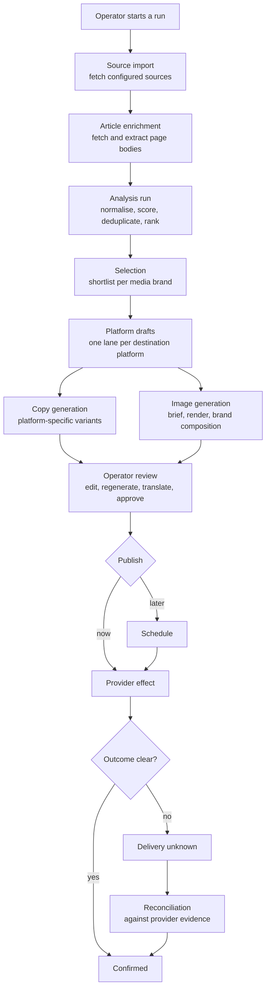

# The domain

How the product actually behaves, in the order things happen. Start here, then go
to the page that owns the part you are working on.

| Page | Covers |
|---|---|
| [Source ingestion](source-ingestion.md) | Fetching sources and article pages, and doing it safely |
| [Editorial pipeline](editorial-pipeline.md) | Filtering, scoring, selection, and the report that explains it |
| [Content generation](content-generation.md) | Copy variants, images, and the model gateway |
| [Publishing](publishing.md) | Approval, scheduling, provider effects, reconciliation |
| [Market analysis](market-analysis.md) | The optional market capability |
| [Localization](localization.md) | Interface locale, content locale, translation |
| [Usage reporting](usage-reporting.md) | What every model call records |
| [Customer template](customer-template.md) | Every configuration field and what it changes |
| [Data model](data-model.md) | Every table, grouped by aggregate |

## The lifecycle end to end

Every box after the first is a durable operation in the worker. Every arrow into
"Operator review" produces a draft, never a published post.

## Vocabulary you need before reading further

These words mean specific things in this codebase, and they are used consistently
in table names, type names and screens.

| Term | Meaning |
|---|---|
| **Installation** | One deployment serving one customer. One workspace row. |
| **Media brand** | A publishing identity within the installation — its own voice, image style and destination accounts. |
| **Destination account** | A named account on a platform. Carries a stable key that the deployment environment binds to a secret. |
| **Platform** | A capability in code: Telegram, X, or Instagram. |
| **Source** | A configured place to fetch items from: an RSS feed or a public Telegram channel. |
| **Source import** | One acquisition run across the configured sources. At most one is in flight per installation. |
| **Source item** | One fetched item's identity. Its content is versioned as revisions. |
| **Analysis run** | One editorial pass over an import's items. Either a news run or a promo run. |
| **Platform draft** | A story routed to one platform's lane, where copy and imagery are produced. |
| **Copy variant** | One generated version of the post text for a platform. |
| **Draft revision** | An operator-edited version of a draft's content. |
| **Operation** | The unit of durable work. Carries a lifecycle, an idempotency key and attempts. |
| **Attempt** | One execution of an operation. Records its own outcome, including "ambiguous". |
| **Publication** | The record of sending a draft to a destination account. |
| **Checkpoint** | A provider-side partial effect recorded before the publication is confirmed. |
| **Reconciliation** | Resolving an ambiguous publication against provider evidence or an operator's attestation. |

## Two ideas that recur everywhere

### Ambiguity is a first-class outcome

An operation attempt can end `succeeded`, `failed_retryable`, `failed_terminal`
or **`ambiguous`**. A publication can be `confirmed` or `delivery_unknown`. An
article enrichment can be `succeeded`, `skipped`, `failed` or **`unknown`**.

This is deliberate and it is everywhere. A network call that times out after the
request was accepted has *not* failed — treating it as a failure produces a
duplicate post; treating it as a success produces a phantom one. So the system
records what it actually knows, and resolves it later against evidence.

### Every rejection carries its reason

Nothing is dropped silently. A source that returned nothing records *why* — an
empty feed, a parse failure, a blocked redirect, a deadline. An item that did not
make the shortlist records whether it was out of the time window, a duplicate,
below the brand-fit threshold, or past the cap. That vocabulary is what makes the
filtering report answer "why is this brand getting no stories" without anyone
reading a log.
