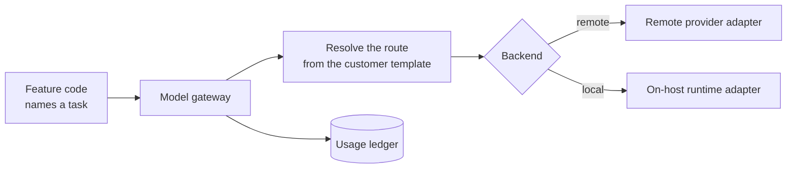
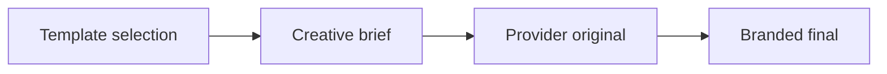

# Content generation

Turning a selected story into platform copy and a branded image — and recording
exactly what that cost.

## The model gateway

**Every model call in the system goes through one application-owned gateway.**
Feature code names a *task*; it never names a provider or a model.

### Task routing

The customer template maps each task key to a backend, a model, and optionally a
fallback route.

Fixed task keys cover the assistant, embeddings, translation, enrichment briefs,
image template selection, image creative briefs and the market art-director
brief. Four prefixed families take a suffix naming an option key: editorial
selection, promo ideas, copy generation and image generation.

An unrecognised task key, or a key the template does not configure, is a
configuration error rather than a runtime fallback. Silently falling back would
hide a misconfiguration until someone noticed the wrong model's voice in
production.

### The fallback ladder

Three invocation keys: **primary**, **retry-1**, and **fallback**.

The first two resolve to the *same* route — the second attempt is a retry of the
same model. Only the third switches to the declared fallback.

Durable workflows choose those attempts explicitly. A bounded typed UI stream
keeps its selected invocation key across model steps and records each provider
call with a zero-based call index. The gateway owns the tool loop, approval request
and typed text, tool and data parts returned to the browser.

**The gateway itself never retries.** Every underlying call is made with retries
disabled. Retry is a durable-execution decision, made by the caller that knows
whether retrying is safe, not a hidden behaviour of the transport.

### Two backends

**Remote** is the only remote provider. It supports structured output,
embeddings, image generation and streaming.

**On-host** is optional per task. It supports structured output and embeddings
only — the adapter interfaces are deliberately asymmetric, so a template routing
image generation locally fails at startup rather than at first use.

### Bounds are asserted before the call

Prompt length, instruction length, embedding value length, embedding batch size,
output tokens and the deadline are all bounded, and a violation fails before any
provider is contacted.

Image invocations get a stricter check derived from the selected option's declared
capabilities: aspect ratio, reference count, per-reference size and the combined
reference payload, MIME types, dimensions and pixel counts.

### Template drift is checked per call

Before every call, the gateway asserts that the template this process loaded still
matches the one applied to the database. A drift raises a distinct error.

A model call must not run against a configuration the process no longer matches —
otherwise a reconcile mid-run produces content generated under rules nobody
selected.

### Prompts and outputs never enter telemetry

Input and output recording is explicitly disabled on every call. Trace attributes
are limited to the operation, attempt and usage identifiers.

## The usage ledger

**Written before the provider call, not after.**

A pending row is inserted first, carrying the operation, the attempt, the
invocation key, the call index, the task, the API kind, the backend, the gateway
and the requested model. Then the call happens. Then the row is finalised.

Writing it first is what makes a crash mid-call visible. A row written afterwards
would simply not exist, and the call would look like it never happened.

### Effectful domain writes and the ledger commit together

The invocation takes a `persistResult` **transaction callback**. The domain write
— the copy variants, the embeddings, the image record — happens inside the *same
transaction* that finalises the usage row.

There is no window in which content exists without its cost recorded, or a cost is
recorded for content that was not saved. If that transaction fails, the outcome is
`ambiguous` with a specific reason, not a guess.

A request-bound assistant stream has no domain write to commit with its model
output. The gateway instead opens and finalises one Usage row for each model step.
The separate signed approval path can admit only a prepared run start or new
Market Analysis.

Market creation keeps model intent and owner commands distinct. A model may name a
configured instrument, but only the server may resolve it against fresh
operator-owned options and construct the identifier-only command. The signed
envelope binds the unchanged SDK input, canonical command and material
fingerprints; approval repeats validation and resolution. Missing creation values
remain bounded conversation state and are collected one focused question at a
time. They are not domain state and cannot authorize an effect.

### Cost has provenance

The remote adapter recovers the provider's generation identifier and the returned
cost — including for image calls, where it reads the response headers directly
because the SDK does not surface them.

**Cost authority is recorded**: billed by the provider when a cost was returned,
unknown when it was not, and local for the on-host backend. **The gateway never
estimates.** A number without its provenance invites false precision, and an
estimate that looks like a bill is worse than no number.

Cost is stored as a decimal **string**, never a float.

Provider metadata is parsed against schemas rather than trusted.

### Provider failures are diagnosed

HTTP statuses map to specific codes: insufficient credits, moderation blocked,
rate limited, provider error, provider rejection. The diagnosis rides alongside
the error in a side channel rather than widening the error's public shape, so it
cannot leak into serialised output.

### Failed and unknown are different

This is the distinction the whole system rests on:

- **`failed`** — the effect definitely did not happen.
- **`unknown`** — it may or may not have happened.

An aborted signal is cancellation. A timeout is *unknown*, not failure — the
request may well have completed on the provider's side. An unclassifiable error is
unknown. Only a diagnosed provider rejection is definitely a failure.

Structured-output invalidity is the one clean definite failure: the model
responded, and its response did not match the schema. That finalises as
non-retryable failure in the same transaction as an optional domain-side record.

### Image generation is the ambiguity-hardened path

Image generation produces bytes that have to be staged into object storage, which
adds a second place the effect can half-happen. It carries four compensation
callbacks:

| Callback | Question it answers |
|---|---|
| `prepareResult` | Stage the bytes |
| `resolvePreparedResult` | Did this actually land? |
| `compensatePreparedResult` | Undo it |
| `rejectUnpreparedResult` | Confirm nothing was staged |

The logic that follows is the interesting part:

- On a definite provider failure, it confirms nothing was staged. **If that
  confirmation does not come back clean, the failure is downgraded to unknown** —
  the provider may have produced an image the deployment cannot account for.
- If the finalising transaction fails, it *interrogates ownership*: if the work
  actually landed, the call **succeeds**; if nothing is there and compensation
  worked, it is a clean definite failure; anything else is unknown.

Most systems would call a failed transaction a failure. Here it asks first,
because a generated image that was stored but not recorded is an orphan nobody
will find.

### Streaming settles every model step

The gateway writes a pending Usage row before each model step and finalises it when
that step ends. A definite provider error is failed. If a stream ends with a step
still unsettled, that row becomes unknown; explicit cancellation makes it
cancelled. This covers abandoned connections without pretending an uncertain
provider outcome was free.

The web Route Handler settles the surrounding assistant operation after draining
the stream, expires the Usage cache tag locally, and sends the browser a transient
refresh signal. A typed error chunk keeps that surrounding operation from being
marked successful. After a completed read or clarification tool call, one
tool-free model step can answer the requested parts from the returned value;
`activeTools` is empty after the first step, so it cannot chain another read or
effect. These rules describe stream accounting and loop control, not a guarantee
that a provider or domain effect succeeded. The operation does not describe every
assistant step as a worker settlement.

### The startup gate

At startup, every configured task's primary and fallback routes are checked: a
remote route requires the remote key, a local route requires the local URL, and
any image-generation task must be remote.

A template routing to a backend this deployment has no secret for fails at
startup, not mid-run.

## Copy generation

A parent function plans the units and fans out; unit functions generate per brand
and variant, with concurrency from the template's fan-out configuration.

Platform policy comes from the template: which variants to produce, the assembled
character range, the hashtag range, an emoji cap.

**Payload assembly is shared.** The publishing ticket in the interface and all
three platform adapters import the same assembler, so what an operator previews is
what gets sent. Length is measured against the platform's real limit — and for
Telegram, against the *caption* limit, because copy generation always assumes a
photo.

The parent's failure handler fails unstarted units and settles when nothing is
still running. A partial result is recorded as partial rather than as failure —
three of four variants generated is a usable outcome that the operator can work
with.

## Image generation

Four stages, each an invoked function:

**Template selection** picks a composition family and axis values from the brand's
image profile. This is the task that prefers the on-host backend where one is
configured — it is a constrained choice over a closed set, not open generation.

**Creative brief** normalises the selection into the instruction the provider
receives.

**Provider original** is the generation call, with its full ambiguity handling.

**Branded final** composes deterministically: resize the original to the profile's
output format, composite the brand logo at its configured anchor and inset, and
validate the raster before storing it.

The composition is pure and its geometry is verified **at template load time**,
mirroring the same arithmetic — so a logo that would not fit is rejected when the
template is validated rather than appearing clipped on a published post.

**A variety memory** stops a brand's imagery converging on one look across
successive runs.

## Enrichment briefs and translation

Article enrichment can produce a structured brief alongside the extracted text.

Translation — of topics, card presentation and copy variants — goes through the
same gateway with hard output validation: cardinality, ordering, script dominance,
and preservation of protected tokens as a multiset. See
[`localization.md`](localization.md).

Every translation prompt states that the supplied text is untrusted data and that
instructions inside it must not be followed.

## Where the code is

| Concern | Path |
|---|---|
| The gateway | `packages/model-gateway/src/gateway.ts` |
| Task routing | `packages/model-gateway/src/task.ts` |
| Remote adapter | `packages/model-gateway/src/openrouter.ts` |
| On-host adapter | `packages/model-gateway/src/ollama.ts` |
| Usage normalisation | `packages/model-gateway/src/usage.ts` |
| The startup gate | `packages/model-gateway/src/prestart.ts` |
| Copy generation | `apps/worker/src/inngest/copy-generation.ts` |
| Image generation | `apps/worker/src/inngest/image-generation.ts` |
| Template selection and composition | `apps/worker/src/image-selection.ts`, `src/image-assembler.ts` |
| Shared payload assembly | `packages/contracts/src/editorial.ts` |

Related: [`usage-reporting.md`](usage-reporting.md) for what the ledger becomes,
and [`publishing.md`](publishing.md) for what happens after approval.
