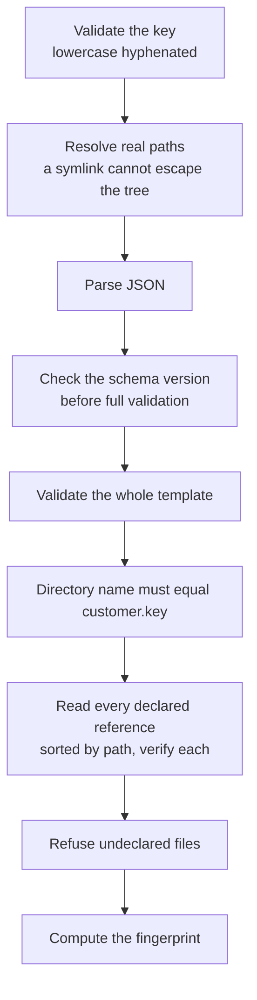

# The customer template

Everything that differs between customers, in one reviewed directory under
version control.

If you are asking "why is this brand getting no stories", "why do all our posters
look the same", or "why can't we publish", the answer is almost always a value on
this page.

## What it is, and what it is not

A customer template is a directory under `customer-templates/<key>/` containing
`template.json` plus exactly the files that template declares. It is selected at
build time by the `CUSTOMER_TEMPLATE_KEY` environment variable, validated during
the build, embedded in the image, and applied to the database by an explicit
reconcile command.

**It is versioned data, not runtime configuration.** These values change how the
product behaves — which sources are read, which model runs which task, what the
thresholds are — so they get review and a diff, not a settings screen. A table
existing is not a reason to build an editor for it.

**No startup path ever seeds.** The reconcile command is the only writer.

## The declared-file boundary

This is the rule that keeps a template honest, and it is unusual enough to state
first.

**A customer directory may contain `template.json` and nothing else except the
files that template fields explicitly declare.** The loader walks the whole
directory and raises `UNDECLARED_FILE` for anything it does not recognise. Files
beginning with a dot are exempt.

Packaging globs cannot compute the declared set, so without this rule the
reviewed set and what actually ships would drift — a stray file would be copied
into the image and nobody would notice.

It is also why `customer-templates/authoring/` exists as a **sibling** rather than
inside a customer's directory. Reviewed source material the loader must never see
— the vector originals behind runtime raster assets — lives there. No build copies
it and no loader reads it.

## Loading, in order



Every step raises a specific code, so a rejection says what is wrong:

| Code | Meaning |
|---|---|
| `INVALID_KEY` | Not a lowercase hyphenated key |
| `TEMPLATE_NOT_FOUND` | No `template.json` at that key |
| `TEMPLATE_ESCAPES_ROOT` | The resolved path is outside the templates tree |
| `INVALID_JSON` | Does not parse |
| `UNSUPPORTED_SCHEMA_VERSION` | The declared version is not the one this build supports |
| `INVALID_TEMPLATE` | Schema validation failed |
| `KEY_MISMATCH` | `customer.key` differs from the directory name |
| `REFERENCE_NOT_FOUND` | A declared file is missing |
| `REFERENCE_ESCAPES_ROOT` | A reference resolves outside the customer directory |
| `IMAGE_PROFILE_INVALID` | Not a valid profile, or its prompt payload exceeds the budget |
| `BRAND_LOGO_INVALID` | Not a PNG, or its declared bytes, dimensions or digest do not match |
| `BRAND_LOGO_GEOMETRY_INVALID` | The composed logo would not fit the canvas |
| `MARKET_COMPOSITION_INVALID` | The composition catalogue is invalid |
| `MARKET_INSTRUMENT_PROFILE_INVALID` | An instrument's visual profile is invalid |
| `MARKET_RASTER_INVALID` | A declared raster failed verification |
| `REVIEWED_KNOWLEDGE_INVALID` | The knowledge sidecar is invalid or repeats a key |
| `UNDECLARED_FILE` | A file exists that no field declares |

The schema version is checked **before** full validation, so a template written
against an older version reports that cleanly rather than as a wall of schema
errors.

### Declared rasters are verified, not trusted

A template does not merely point at an image. For every raster it declares the
byte length, the pixel dimensions and the SHA-256 digest — and the loader
verifies all of them, after checking the PNG signature and reading the dimensions
out of the header itself rather than believing the declaration.

It goes one step further for brand logos: it mirrors the image assembler's
arithmetic to check that the resized logo plus its inset actually fits inside the
output canvas. A geometry error surfaces at load time rather than as a clipped
logo on a published post.

### The fingerprint

The fingerprint is a SHA-256 over a canonical serialisation of the validated
template **plus the path and digest of every declared reference**.

Canonicalisation sorts object keys and **preserves authored array order**.
Reformatting the JSON does not move the hash; reordering an array does, because
order is meaningful. Changing a single pixel of a brand logo changes the
fingerprint, because the digest of every reference is part of the input.

That fingerprint is what the build embeds, what the reconcile writes to the
database, and what both applications compare at startup and on every readiness
check.

## What the template configures

### Identity

`customer.key` (must equal the directory name), `customer.productName`,
`customer.timeZone` (validated by actually constructing a formatter with it,
rather than against an allowlist that would reject legitimate aliases), and
`workspace.name`.

### Media brands

Each brand has a stable key, a name, and optionally a brand guidance document, an
image profile and a brand logo. **The image profile and the brand logo are a
pair** — declaring one without the other is rejected, because the profile
describes a canvas the logo has to fit.

Each brand's editorial block is its scoring vocabulary:

| Field | Effect |
|---|---|
| `mediaFitThreshold` | The minimum fit score before a story is admitted for this brand |
| `strongTerms` | Positively weighted signals |
| `weakTerms` | Negatively weighted signals |
| `phrases` | Multi-word positive signals |
| `aliases` | Surface forms folded to one canonical term |
| `preferredSourceKeys` | Sources this brand prefers |
| `semanticAnchors` | Text embedded to measure semantic similarity to this brand |
| `promoEnabled` | Whether promotional runs may target this brand |
| `canonicalHashtags` | One brand hashtag per content locale |
| `valueGate` | Optional hard gate: no concrete figure or forecast term, no consideration |

Strong terms, weak terms and phrases share **one namespace** — the same term
cannot appear in two of them.

### Sources

Discriminated by origin. A feed source carries a URL and its article fetch mode;
a public channel source carries a validated handle.

**An enabled source must be English.** A Persian source is a schema error, not a
silent skip. The schema states this explicitly rather than letting it surface as
an empty import.

Acquisition and enrichment carry the budgets: the default look-back window, items
per source, the ordering mode and top-N for channel sources, and whether
enrichment runs with what per-import ceiling and freshness window.

### Editorial

The largest section, and the one that decides what publishes.

| Group | Contains |
|---|---|
| `models` | The editorial model options offered in the interface |
| `platforms` | The platforms this installation drafts for |
| `topicAliases` | Surface forms for operator topics |
| `defaults` | Preselected brands, models, platforms, window, enrichment and optional source subset |
| `shortlistCap`, `selectionCap` | How many items survive filtering, and how many the model may select |
| `importReuseMinutes` | The window in which a settled import is reused instead of re-fetched |
| `fanOut` | The ceiling on models × brands per run, and how many run in parallel |
| `promo` | Ideas generated per brand, and the operator prompt limit |
| `semantic` | Candidates, topics and anchors embedded; maximum embedded length; the duplicate threshold; and how much brand and topic similarity contribute |
| `policy.weights` | Two weight sets — one including the topic term, one without |
| `policy.thresholds` | The composite score and topic score floors |
| `policy.freshnessLadder` | The age-to-score step function |
| `policy.futureDateNeutralScore` | What a future-dated item scores |
| `policy.virality` | The power and entity lexicons, title and body multipliers, and per-signal weights |
| `policy.sourceAuthority` | Per-source authority, plus the score for a source with no entry |

Drafting sits alongside it: per platform, the copy variants to produce, the
assembled character range, the hashtag range and an emoji cap; plus the image
model options and which is the default.

### Destination accounts

A closed set — a platform exists only once its adapter ships.

| Platform | Non-secret metadata |
|---|---|
| Telegram | A label, and a channel as either a username or a numeric chat identifier |
| X | A label |
| Instagram | A label, a professional account identifier, optionally a username |

The identifiers here are **account path segments, not credentials**. The secret
lives in the deployment environment, bound to the account's stable key. An
enabled Telegram destination without a channel is rejected.

`brandDestinations` is the many-to-many map from brands to accounts.

### Model tasks

Routing for the model gateway. Feature code names a task; this section says which
backend and model serve it.

Fixed task keys cover the assistant, embeddings, translation, enrichment briefs,
image template selection, image creative briefs and the market art-director
brief. Four prefixed families take a suffix naming an option key: editorial
selection, promo ideas, copy generation and image generation.

Each route names a backend — `remote` or `local` — and a model, with an optional
fallback route.

### Reviewed knowledge

Optional documents backing the operator assistant: a frequently-asked-questions
sidecar, a workspace overview, and per-brand documents.

These follow the **operator's interface language**, not the content locale, and
are never mixed or translated. A document is identified by a synthetic identifier
and a digest rather than by a file path, so a citation cannot expose the artifact
layout.

### Market analysis

A tagged union on `enabled`. When it is off, the template carries a single flag
and no market configuration at all — no dummy instruments, no placeholder assets.

When on: the comparison provider, the instruments with their per-provider
mappings and visual profiles, the brand-to-instrument mapping, the composition
catalogue, the approved and default image options, the enabled periods and
scales, the featured comparison symbols, and the defaults.

## The cross-field rules

Individual fields are easy. The rules **between** fields are where the real
constraints live, and every one of them exists because its absence produced a
confusing failure somewhere downstream.

### Completeness

**Every editorial model option must have all three routes** — selection, promo
ideas and copy generation. An option offered in the interface that cannot
generate is a trap.

**Every required fixed task must be routed**, plus the enrichment brief when
enrichment is enabled, plus the market art-director brief when market analysis is
enabled. Conditional requirements track the capability rather than being always
required.

**Every image model option must be routed**, and the default must exist and be
enabled.

**Every declared platform must have a drafting policy**, and every policy must
correspond to a declared platform. Both directions.

### Orphans

A prefixed task family accepts any suffix, so a route naming an option that does
not exist would validate, never be asserted at startup, and silently do nothing.
The schema therefore rejects orphaned routes explicitly — for both editorial and
image families.

### Arithmetic

- **Weights must sum to one**, within a small tolerance, in both weight blocks.
- **The freshness ladder must strictly increase** in age.
- **Semantic brand and topic weights may not exceed one** together.
- **Embedding capacity must fit**: candidates plus topics plus brands times
  anchors must stay within the batch limit. Every embedded value rides one call,
  so one oversized configuration fails the whole stage.
- **The selection cap may not exceed the shortlist cap** — you cannot select more
  than survived filtering.
- Character and hashtag ranges may not be reversed.

### Platform reality

A Telegram policy's maximum assembled characters may not exceed the caption
limit less a read-more reserve. Copy generation always assumes a photo, so the
caption ceiling is the one that binds — not the message ceiling.

### Semantic anchors

A brand with no anchor has no similarity, and every fallback would fabricate one.
So when the brand semantic weight is above zero, **every brand must have at least
one anchor**. Anchors are also individually length-bounded, because one long
value fails the batch for everyone.

### Market analysis

When it is enabled, **every copy platform policy must declare exactly three
variants**, and the approved image option must support at least two ordered
references, the combined byte budget and the PNG type — because a market poster
carries two image references.

Provider mappings must be ordered primary-first: the first is primary, every
later one is a fallback, and the schema checks that the flags match the
positions.

### Duplicates

Checked everywhere: brand, source and destination keys; source endpoints; brand
vocabulary; preferred sources; semantic anchors; alias canonicals and surfaces;
editorial models and platforms; virality terms; drafting platforms and copy
variants; image models; market instruments, image options, periods, scales and
comparison symbols.

Alias comparison normalises to NFKC, lowercases and collapses whitespace before
comparing — so two entries that look different but are the same term collide as
they should.

## Image profiles

A per-brand document describing how that brand's imagery looks. It is a typed,
closed-set document rather than prose, because the model's selection is
constrained by it.

| Section | Contents |
|---|---|
| `families` | Named composition skeletons, each with a text policy, default axis values and a data budget |
| `axes` | Named axes and their values. A value's description may be the empty string — that is the authored way to say "this value adds nothing to the scene". |
| `frozenStyle` | The prose that never varies: format, palette, materials, rendering, background vocabulary, headline zone, and what to never do |
| `restrictions` | Anti-repetition, mood and environment restrictions, optional axes, banned subject terms |
| `textPolicy` | Headline rules and word limits, legibility, and the data-element templates |
| `output` | Width, height and format |
| `logo` | Anchor corner, width ratio and inset ratio, both relative to the canvas short side |
| `fallbackBrief` | A complete valid selection and brief, used when the model does not produce one |

The fallback must be complete: it must name **every** declared axis, may be null
only for an axis marked optional, and its data elements may not exceed the
family's budget. A fallback that would itself be rejected is not a fallback.

The profile's selection prompt payload is measured at load time against a
budget computed from the model prompt limit less the reserve and the source
allowance. The worker sends that exact payload, and the loader measures that
exact string — one owner, so the check and the use cannot diverge.

## The three shipped templates

| | `chainreporter` | `rzwire` | `demo-sports` |
|---|---|---|---|
| Brands | 4 | 7 | 3 |
| Sources | 45 | 45 | 4 |
| Destinations | Telegram, X | Telegram, X | Telegram, X, **Instagram** |
| Market analysis | Off | **On** | Off |
| Time zone | Asia/Tehran | Asia/Tehran | UTC |

`demo-sports` is synthetic and it earns its place: it is a sports desk, in an
unrelated domain, validating against the same schema. It is also the only
template with an Instagram destination. If a change to "reusable" code assumes
crypto, this template is where that shows up.

## Working with a template

```bash
# Validate every template directory, including the declared-file boundary
pnpm --filter @rz-chain-reporter/customer-template validate

# Compare the database against the template without writing
pnpm template:reconcile --check

# Apply it
pnpm template:reconcile
```

The validate command prints one line per template with its schema version,
fingerprint and the number of verified references.

`--check` runs in a read-only database transaction — enforced by PostgreSQL, not
by application discipline — and exits with a distinct code on divergence.

### What reconcile will and will not do

It reconciles six entity kinds: the workspace, brands, market instruments,
sources, destination accounts and brand-to-destination mappings.

**Exactly one change is blocked** rather than applied: changing an existing
destination account's platform. Everything else is applied — renaming a brand,
changing a source's endpoint or origin, disabling or retiring anything.

Disabling market analysis **retires** its instruments rather than leaving them
behind. Retire and restore are the soft-delete transitions, so a later re-enable
brings them back rather than creating duplicates.

The reconciler never touches the binding projection columns — whether a
destination's secret is present is a runtime fact recorded by a separate step.

A workspace row with no template key is adopted. One holding a **different** key
raises a foreign-installation error and is never rewritten. That is the guard
against pointing a reconcile at another customer's database.

## Changing a template

1. Decide the owner first. A secret goes to the deployment environment. A
   platform capability goes to code. Everything else goes here.
2. Edit `template.json`, and add any new file **and the field that declares it** —
   the loader rejects the directory otherwise.
3. Validate.
4. Reconcile with `--check`, read the report, then apply.
5. Rebuild and redeploy. The fingerprint changed, so a running process serving the
   old one will report itself unready until it is replaced.

That last step is the one people forget. The template is embedded in the image;
editing the file on a host changes nothing until the artifact is rebuilt.
