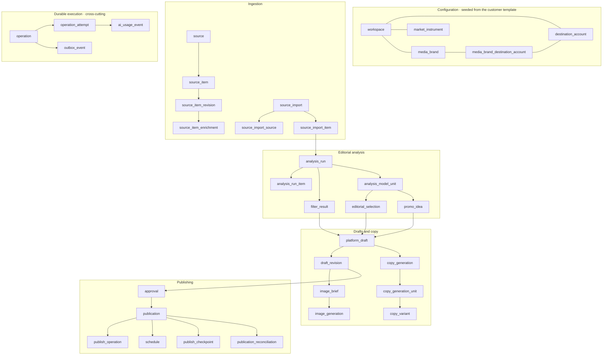

# Data model

**64 tables** and **52 enum types**, defined in TypeScript with Drizzle under
`packages/db/src/schema/` and applied as reviewed SQL migrations.

The schema uses **no extensions at all** — no `CREATE EXTENSION` appears anywhere
in the migration tree. Primary keys use PostgreSQL's built-in time-ordered UUID
function, which keeps index inserts local instead of scattering them across the
the B-tree the way random UUIDs do. That function arrived in PostgreSQL 18, so 18
is the version floor. It is the only version this documentation states, because
it is the only one that is a fact about the schema rather than a snapshot of what
happens to be installed.

## Reading the schema

Four column helpers are spread into almost every table:

| Helper | Adds |
|---|---|
| Primary key | `id uuid primary key`, time-ordered by default |
| Timestamps | `created_at`, `updated_at`, both timezone-aware |
| Soft delete | A nullable `deleted_at`, for entities that retire rather than disappear |
| Workspace scope | `workspace_id uuid not null` |

Soft delete is used on exactly the configuration entities that a customer might
retire and later restore: brands, destination accounts, brand-to-account
mappings, sources, platform drafts and market instruments.

### Every foreign key is named by hand, and that is load-bearing

Constraints are declared with explicit `fk_…` names rather than inline
references. The error classifier reads constraint names out of the driver's error
to turn a database failure into a domain outcome: a foreign-key violation on a
`fk_`-prefixed constraint becomes a "not found" result rather than a 500.

An auto-generated constraint name would not be recognised. This is stated in the
helper module itself.

Three specific unique constraints carry domain meaning the same way, mapping to
"an import is already running", "this card is already saved", and the operation
identity rule described below.

### Business rules live in the database where they can

Serialization failures and deadlocks are classified as retryable, so the caller
retries rather than surfacing an error. And several rules that application code
*could* enforce are instead enforced by the database, because two concurrent
requests cannot both win a race PostgreSQL is arbitrating.

## The aggregates

`workspace` is the scope of everything and is best drawn as a frame rather than a
node — every customer-owned table carries `workspace_id`.

---

## A · Authentication and installation identity

`user`, `session`, `account`, `verification`, `rate_limit`, `auth_throttle`,
`workspace`

The first five are the authentication library's own tables and follow its
conventions — text identifiers rather than UUIDs, and naked timestamps. Deleting
a user cascades their sessions and credentials.

`auth_throttle` is application-owned and deliberately different: the throttle
bucket string *is* the primary key, alongside a window start and an attempt
count, indexed on the window so old buckets can be swept.

**`workspace` is the installation.** Exactly one row. Both the reconciler and the
startup identity gate refuse to proceed if they find two — one deployment serves
exactly one customer, and more than one row means something is seriously wrong.

It carries the applied template key, the applied fingerprint and when it was
applied. That is what the readiness endpoints compare against, so a process
serving a configuration the database does not hold reports itself unready.

It also carries a **generated** name key, computed by a SQL function that is
worth knowing about:

> `fold_unique_name_v1` is a complete bilingual Unicode normaliser written in
> SQL: NFKC normalisation, zero-width and bidirectional control stripping,
> Arabic-to-Persian letter folding, Arabic-Indic digit folding, whitespace
> collapse, and a deterministic collation. It deliberately preserves alef with
> madda as meaning-bearing rather than folding it away. Its header declares it
> **frozen once applied** — a rule change ships as a `_v2` function plus a column
> and index rebuild, never as an edit, because editing it would silently change
> the identity of rows already stored.

---

## B · Configuration seeded from the customer template

`media_brand`, `destination_account`, `media_brand_destination_account`,
`market_instrument`

Written only by the reconcile command; no startup path ever seeds them.

`destination_account` is where the secret boundary shows up in the schema. It
holds a **stable key**, the platform, whether it is enabled, and non-secret
metadata such as a channel identifier — and never the credential. Two projection
columns record whether the deployment environment currently has a binding for
that key and when it was last checked. That projection is written by a separate
step and is deliberately not touched by the reconciler.

`media_brand_destination_account` is the many-to-many mapping. Its unique
constraint name is truncated with a hash suffix, a pattern used throughout the
schema wherever the natural name would exceed PostgreSQL's identifier length
limit.

---

## C · Sources and ingestion

`source`, `source_item`, `source_item_revision`, `source_item_enrichment`,
`source_import`, `source_import_source`, `source_import_item`

`source` deliberately does **not** carry keywords, weights, thresholds or source
authority. Those are template values consumed at run time, not row data — a
comment in the file says so, because the temptation to put them there is
constant.

`source_item` holds identity; its content columns are the frozen first-seen
snapshot. Later content lives on `source_item_revision`, which is uniquely
constrained on `(item, content hash)` — so a refetch that changed nothing is a
no-op rather than a new revision.

`source_import` carries the operator's raw topics as an array and their
locale-projected form as a JSON column. That column is validated by a check
constraint that verifies the object's exact keys, that the locale is one of the
two, that the projected values are an array of strings, and that its length
equals the raw topic count. A malformed projection cannot be stored.

Its most important property is a **partial unique index on the workspace where
the stage is not settled**: at most one import may be in flight per installation,
arbitrated by PostgreSQL rather than by application logic. A violation of that
exact constraint name is mapped to a clean domain error.

---

## D · Editorial analysis

`analysis_run`, `analysis_run_item`, `filter_result`, `analysis_model_unit`,
`editorial_selection`, `promo_idea`

`analysis_run_item` records, per item: eligibility, how a duplicate was detected
and against which item, and every component score — source authority, freshness,
virality, lexical topic and its index, semantic topic and its index, and whether
the item participated in the semantic stage.

`filter_result` is one row per item **per media brand**, carrying the disposition
and the reason. Together these two tables are the complete answer to "why did this
brand get nothing today", queryable rather than reconstructed from logs.

---

## E · Platform drafts, revisions and copy

`platform_draft`, `draft_revision`, `draft_revision_command_receipt`,
`copy_generation`, `copy_generation_unit`, `copy_variant`

### A draft has exactly one origin

| Origin | Meaning |
|---|---|
| An editorial selection | A story the model picked for this brand |
| A Telegram-lane filter result | A story routed straight to the lane without a model selection |
| A promo idea | A brand promotion with no underlying source item |
| A market analysis handoff | A completed market poster |

Enforced three ways: a check constraint requiring exactly one non-null origin,
four partial unique indexes ensuring one live draft per origin per brand per
platform, and a constraint restricting lane positions to the origins that occupy
a lane.

### Revisions are guarded by triggers, not by convention

This is the largest business rule in the schema, and it is worth understanding
because it is invisible in the TypeScript.

**Copy is immutable.** Once a revision exists, every content column is frozen.
Only the selected media and the image-intent version may ever change.

**Media freezes at approval.** If an approval exists for a revision, its media
columns cannot change at all.

**Media transitions must be legal.** Changing the selected media without bumping
the intent version requires a matching image generation to exist for that
revision, that intent version and that asset. Otherwise the intent version may
only stay the same or increment by exactly one.

**Selected media must be publishable.** A non-null asset must be verified, still
present, and be one of: an operator upload, a final image produced for *this same
draft*, or a market poster from the handoff this draft was routed from.

Two more triggers keep the projection honest. Changing a revision's media bumps
the draft's projection version — and if it cannot take the lock immediately, it
**deliberately converts the lock conflict into a serialization failure** so the
caller's retry classifier picks it up rather than surfacing a lock error.
Changing a draft's active revision bumps the projection version in a `BEFORE`
trigger, so the bump costs no second write.

---

## F · Localization

`copy_variant_localization_request`, `copy_variant_localization`,
`editorial_presentation_localization_request`,
`editorial_presentation_localization`

Both follow the same shape: a request table keyed by its operation, and an
immutable result table.

A localization is **complete or absent** — never partial. Rows are written only
on success, and never updated. Partial unique indexes ensure one localization per
subject per locale, and the request tables use exactly-one-of constraints across
their subject columns.

A read therefore selects either a complete translation or the complete
authoritative original. There is no state in which a card shows half a
translation.

---

## G · Images and media

`media_asset`, `media_derivation`, `image_brief`, `image_generation`,
`image_variety_memory`, `publishing_media_grant`

`media_asset` is the database's ownership of an object in storage, with a
lifecycle: pending, uploaded, validating, verified, rejected, expired. The
database owns that state, which is what makes an orphaned object detectable.

`media_derivation` records that one asset was derived from another — a
brand-composited image from a generated original, a footer lockup from a source
graphic. A composite foreign key ensures a draft's final image is genuinely a
derived asset rather than a raw provider output.

`image_variety_memory` is what stops a brand's imagery converging on one look
over successive runs.

`publishing_media_grant` backs the short-lived opaque capability that lets a
publishing platform fetch one image over HTTPS without the browser or the
platform ever touching object storage.

---

## H · Market analysis

`market_comparison_catalog_state`, `market_comparison_catalog`,
`market_snapshot`, `market_snapshot_series`, `market_analysis`,
`market_chart_render`, `market_chart_default`, `market_generation`,
`market_analysis_handoff`

Present in every installation's schema; populated only when the template enables
the capability.

**Verified data is immutable, enforced by a trigger that fabricates a
check-constraint violation.** The trigger raises the check-violation error code
with a constraint name passed as its argument — so an attempted update to a
snapshot surfaces as a violation of a constraint that does not exist as a real
constraint. Application code classifies it identically to a real one, which is
the point: one code path for one meaning.

Snapshots, series and handoffs are all immutable this way, and a completed
analysis can be neither updated nor deleted.

**A superseded render can never install itself.** When a chart render is
verified, a trigger conditionally installs it onto the analysis, guarded on the
analysis still pointing at *this* render, still having no chart, still being in
progress, and the fingerprints still matching. It then checks that exactly one
row was updated and raises otherwise. A render that finished after the operator
moved on cannot overwrite the current one.

A render may be verified **exactly once**, and only against an asset that is
verified, present and checksummed.

---

## I · Publishing and scheduling

`approval`, `publication`, `schedule`, `publish_operation`, `publish_checkpoint`,
`publication_reconciliation`, `publishing_control`, `saved_card`

**An approval is a snapshot, validated on insert.** A trigger locks the draft and
the revision, then requires all three of the draft's active revision, the
platform, and the selected media to match the approval being inserted. A
mismatch is rejected.

It also **rejects the approval if any image generation for that revision is still
queued, running or settling.** You cannot approve a draft while its image is
still being made — which closes the race where an approval snapshots one image
and a generation finishing a second later replaces it.

Approvals are then immutable: separate triggers reject every update and every
delete.

`publish_checkpoint` records provider-side partial effects — a message, an
uploaded media object, a container — so a resumed publish resumes rather than
restarts.

`schedule` is self-referencing through a predecessor link, with a unique
constraint making the reschedule chain linear rather than a tree.

`saved_card` has a partial unique index on active saves, so one operator cannot
hold two active saves of the same draft.

---

## J · Durable operations, outbox, usage and activity

`operation`, `operation_attempt`, `outbox_event`, `ai_usage_event`,
`activity_event`

`operation` is the unit of durable work: a lifecycle, an idempotency key, a
request hash, an actor and a version. Its identity constraint over workspace,
actor, command type and idempotency key is what makes a replayed command a replay
rather than a second execution — and the classifier maps a violation of it to a
distinct outcome, because the walker cannot see the stored request hash and only
the use case can decide replay versus idempotency mismatch.

`operation_attempt` records each execution and its outcome, including `ambiguous`.

`outbox_event` is the handoff. A partial index over undispatched, unexhausted
rows serves the relay's claim query. A second partial unique index ensures at
most one live market-generation wake.

`ai_usage_event` records what every model call cost. A partial unique index on
the provider's generation identifier ensures one reconciliation per generation —
so a later cost correction updates the row rather than adding a second.

`activity_event` is the operator-visible audit trail, with a vocabulary of
eighteen event types covering saves, approvals, schedules, publications,
reconciliations, attestations and pauses.

---

## K · Assistant

`assistant_conversation`, `assistant_message`

The current assistant does not read or write these tables. Its bounded
conversation and pending proposal state stay in browser-local history; admitted
runs and Market analyses use their owning domain tables. The assistant owns no
editorial state.

---

## Patterns that repeat

Recognising these makes the rest of the schema read quickly.

| Pattern | What it looks like | Why |
|---|---|---|
| **Aggregate equals command** | The operation identifier *is* the primary key | Copy generation, image generation, publish operations and both localization requests. One command, one row, structurally. |
| **Exactly one of** | `num_nonnulls(...) = 1` | Draft origins, localization subjects |
| **All or nothing** | `num_nonnulls(a, b, c) in (0, 3)` | Lease triplets and approval triplets — a half-set lease is not a state |
| **Version compare-and-swap** | A positive integer version column | Eleven tables. Optimistic concurrency without a lock. |
| **Non-blank text** | `btrim(x) <> ''` | Whitespace is not a value |
| **Non-empty array with no nulls** | Cardinality and position checks | Hashtag lists |
| **Bounded JSON arrays** | Explicit maximum lengths | Rejection lists, warnings — an unbounded array is an unbounded row |
| **Instagram requires media** | The same check on four tables | The platform cannot publish text alone, and every table on the path enforces it |

## Concurrency

**No isolation level is set anywhere.** Concurrency is handled explicitly and
locally instead:

- Row locks at roughly a hundred sites.
- Skip-locked claiming where a worker takes the next available row.
- Ten distinct advisory locks for deployment-wide coordination.
- Partial unique indexes for single-in-flight rules.
- Version compare-and-swap on eleven tables.

Choosing these over a global isolation level means each contention point states
what it is protecting, at the point it protects it.

## The reconciler

`pnpm template:reconcile [--check]` applies the customer template. It reconciles
six entity kinds — workspace, brands, market instruments, sources, destination
accounts and brand-to-account mappings — in one transaction, under a
deployment-wide advisory lock.

`--check` is enforced by **PostgreSQL**, in a read-only transaction, not by
application discipline. It exits with a distinct code on divergence.

A workspace row with a null template key is adopted. One holding a *different*
key raises a foreign-installation error and is never rewritten — that is the
guard against pointing a reconcile at another customer's database.

**Exactly one change is blocked** rather than applied: changing an existing
destination account's platform. Everything else — renaming a brand, changing a
source's endpoint, retiring or restoring anything — is applied. Retire and
restore are the soft-delete transitions, so disabling market analysis retires its
instruments rather than leaving them behind.

An identical rerun leaves the applied timestamp untouched.

## Migrations

Forward-only SQL, generated from the schema and reviewed before commit. **45
migrations** today. See
[`../operations/database-migrations.md`](../operations/database-migrations.md).

Three are repair migrations rewriting trigger bodies or re-adding constraints
under existence guards, so they are no-ops on a database that already has them.

## Probes

Eleven executable proofs under `packages/db/src/probes/`. Each builds a real
fixture in a real database, exercises real repository functions — several with
genuinely concurrent transactions — asserts, cleans up and prints an explicit
summary.

They are how the schema's guarantees are verified in the absence of a test
framework: that candidate loading cannot leak sources the operator did not
select, that a draft has exactly one origin, that concurrent commands with the
same key produce one winner and one typed loser, that immutable rows reject
updates, that a superseded render cannot attach itself, and that a translation
event payload carries identifiers rather than content.

## Two places to be careful

**The locale set is duplicated in raw SQL.** A check constraint on the source
import's projected topics hardcodes the two locale codes, even though the
corresponding column is an enum derived from the shared locale facts. So does a
constraint on the usage event's invocation key. Changing either set means
changing the SQL too — the enum will not carry it.

**Three foreign keys were re-added by a later migration** under existence guards.
The migration records no reason, so the mechanism is evidence but the motivation
is not. Do not read it as a pattern to imitate.
