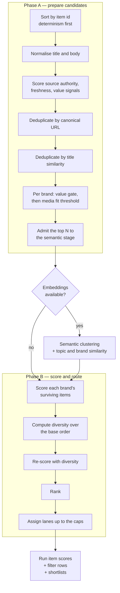

# The editorial pipeline

Turning an import's items into a shortlist per media brand, with a recorded
reason for every decision.

This is the part of the system with the most product judgement in it, and it is
deliberately the part with the least magic. The filtering directory performs no
input or output and never calls a model. It takes items, configuration and — when
available — embedding vectors, and returns scores, filter rows and shortlists. The
same inputs always produce the same output, which is what makes a run
explainable months later.

## Why determinism was chosen here

An operator asking "why did this brand get nothing today" needs an answer, not a
log. If selection were a model call, the answer would be a paraphrase. Because it
is arithmetic over configured weights, the report can say exactly which threshold
was missed and by how much.

Every stage is versioned — normalisation, projection and scoring each carry a
version constant — so a run recorded under an older version can still be
explained by the rules that were actually in force.

## The two phases



Determinism is established before anything is computed: items are sorted by
identifier first, so no ordering decision downstream depends on the order the
database happened to return rows in.

## Normalisation

Text is normalised once, and everything downstream compares against that form:
Unicode NFKC normalisation, then Arabic-Indic and extended Arabic-Indic digits
folded to ASCII, then lowercased, whitespace collapsed, trimmed.

The digit folding is the bilingual product showing up in the lowest-level
function. A Persian article writing a figure in Persian digits and an English
article writing the same figure in ASCII digits must match the same keyword rule,
or every numeric term would need two configurations.

Term matching requires a **word boundary** on both sides — neither neighbour may
be a letter or a number. Without that, a three-letter ticker matches inside
ordinary words and every brand's keyword list quietly poisons itself.

Aliases are groups: a canonical term plus its surface forms, all normalised. A
hit on any surface counts as a hit on the group.

## Projection

One string per item: the normalised title, a space, the normalised summary. That
single string is *both* the semantic embedding input and the lexical matching
text.

Using one projection for both is a real design choice. It means a term the
lexical scorer can see is a term the embedding saw, so the two scores are talking
about the same document. Truncation is by code point rather than by UTF-16 unit,
so a bound cannot cut a character in half.

## The scores

Every published score is clamped to 0–100. Every weight, threshold and ladder
below is a customer-template value — none of these numbers is in the code.

### Freshness

A ladder of age rungs. The first rung whose maximum age exceeds the item's age
wins; past the last rung, the terminal rung's score applies.

Two edge cases are handled explicitly rather than incidentally. An **undated**
item gets no freshness score at all — `null`, not zero, because "we don't know"
and "it's old" are different facts. A **future-dated** item gets a configured
neutral score: publishers do post-date things, and a future date must never be
rewarded as maximum freshness.

### Value signals

Regular expressions over the normalised text detect four kinds of concrete
figure: a standalone number of four or more digits, a percentage, a currency
amount, and a magnitude amount such as "3.2 billion".

A brand may configure a **value gate**: unless the item carries at least one of a
named set of signal kinds, or matches one of a set of forecast terms, that brand
does not consider it at all. This is how a brand that only publishes
substantiated market stories avoids commentary pieces.

### Media fit

How well an item matches one brand's editorial identity:

```
2 × weight(title, strong terms)  +  weight(body, strong terms)
+   weight(title, weak terms)    +  weight(body, weak terms)
+ 2 × weight(title, phrases)     +  weight(body, phrases)
```

Title evidence counts double for strong terms and phrases. A term in the headline
is a stronger claim about what the piece is about than the same term buried in
paragraph nine.

Media fit has its own threshold. Falling below it is recorded as *below media fit
threshold* — one of the two named filtering reasons an operator will see.

### Virality

Power terms and entity terms, weighted, plus a per-kind weight for each value
signal present.

The body contribution is computed as the *excess* of the body multiplier over the
title multiplier, so a term appearing in both is not counted twice.

### Diversity

Walking the ranked list, the nth previously-seen item from the same source scores
progressively lower on a fixed ladder. One prolific source cannot take over a
brand's shortlist.

Because diversity depends on order and order depends on score, it is computed in
two passes: score everything with diversity at zero to establish a base order,
compute diversity over that order, then re-score. That is why the code scores
twice, and it is deliberate.

### Topic

For each topic group, the better of the original topic — with the template's
configured aliases — and the locale-projected effective topic. A title hit scores
substantially higher than a body hit. The best group across all topics wins, and
which group won is recorded, so the report can say *which* topic matched.

### Policy score and rank score

The policy score is the weighted sum of media fit, topic, virality, freshness,
source authority, source preference and diversity. Two weight sets exist — one
including the topic term and one without it — chosen by whether the run has
topics at all, rather than by silently weighting a missing signal as zero.

```
passed = policyScore >= policy threshold
         AND (no topics OR topicScore >= topic threshold)
```

The rank score is the policy score when there are no embeddings. With embeddings
it blends in semantic similarity to the topics and to the brand's configured
anchors, at template-configured weights. If there is no semantic topic score, its
weight collapses to zero rather than the blend being skipped entirely.

## Deduplication

Three methods, applied in order, each recording *how* the duplicate was found.

**By canonical URL.** URLs are canonicalised first: fragment, credentials, every
`utm_*` parameter and a fixed list of known click identifiers are stripped, the
remaining query is sorted, one trailing slash is dropped. Two syndications of the
same story that differ only by tracking parameters collapse. Recorded similarity
is exact.

**By title similarity.** Titles are split into significant terms above a minimum
length, and compared by Jaccard similarity in basis points against a
template-configured threshold. Pairs at or above it form clusters through a
deterministic breadth-first connected-components pass — nodes, neighbours and
components all sorted, so the same input always yields the same clustering.

**Semantically.** Cosine similarity between embedding vectors, in basis points,
through the same clustering pass and the same threshold.

### Choosing the survivor

Identical for all three methods, and fully ordered so there is never a tie:
source authority descending, then freshness descending (with no-freshness sorting
last), then content length descending, then item identifier ascending.

The final tiebreak on identifier is what guarantees two runs over the same data
pick the same survivor.

## The semantic stage

Embeddings are requested as **one ordered batch** with a layout describing how to
read it back: the admitted items' projections, then the effective topics, then
each brand's anchors. One call, one layout, one validation.

The returned batch is validated before use — the count must match the layout
exactly, every vector must share one non-zero dimension, and every component must
be finite.

If any of that fails, the stage **degrades** rather than the run failing. The run
records that it degraded and why: the call failed, the dimensions disagreed, a
component was not finite, the outcome was ambiguous, or the request exceeded its
bounds. Scoring then proceeds without semantic terms.

That is the important behaviour. An embedding provider having a bad minute
produces a run with slightly worse ranking and an honest record of it, not a
failed run and not a silently different one.

## Routing and lanes

For each brand, in template order:

- Duplicates are skipped entirely.
- Items whose route failed the gate or the media-fit threshold emit a filter row
  with disposition *no media fit* and the specific reason.
- Passing items are ranked, then assigned:
  - Feed-origin items fill the **shortlist** up to the shortlist cap.
  - Other-origin items fill the **Telegram lane** up to its cap.
  - Overflow in either becomes *cap exceeded*.
- Passing-but-unrouted rows emit *low score*.

Filter rows are finally sorted by brand and item, so the persisted explanation is
byte-stable for a given input.

## The vocabulary an operator sees

| Disposition | Meaning |
|---|---|
| `shortlisted` | Selected for this brand |
| `telegram_lane` | Selected into the non-feed lane |
| `no_media_fit` | Did not clear this brand's gate or fit threshold |
| `low_score` | Cleared the gate, did not clear the policy threshold |
| `cap_exceeded` | Would have been selected, but the cap was already full |

| Filtering reason | Meaning |
|---|---|
| `missing_required_value_signal` | The brand's value gate found no concrete figure or forecast term |
| `below_media_fit_threshold` | Media fit scored under the brand's threshold |

Together with the eligibility values — candidate, out of window, undated,
duplicate — this is the whole answer to "why did this not publish". No log
reading required.

## Regression protection

There is no test framework, so the pipeline is protected by a fixture command
that runs the whole thing over committed frozen inputs and compares the output.
Because every stage is deterministic and every tiebreak is total, any drift in
scoring, deduplication or lane assignment shows up as a diff.

## Where the code is

| Concern | Path |
|---|---|
| Normalisation and term matching | `apps/worker/src/editorial/text.ts` |
| Projection | `apps/worker/src/editorial/projection.ts` |
| Freshness | `apps/worker/src/editorial/freshness.ts` |
| Scores | `apps/worker/src/editorial/scoring.ts` |
| Deduplication | `apps/worker/src/editorial/dedup.ts` |
| Semantic planning and reading | `apps/worker/src/editorial/semantic.ts` |
| The two phases | `apps/worker/src/editorial/pipeline.ts` |
| Fixture regression command | `apps/worker/src/editorial/fixture-cli.ts` |

Related: [`content-generation.md`](content-generation.md) picks up from the
shortlist.
