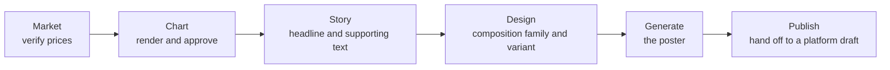

# Market analysis

An optional capability that charts market instruments and produces branded market
posters.

**It is switched on by the customer template.** When a template disables it, the
navigation entry does not appear, the routes return not-found, the template
carries no market configuration at all, and the worker's market functions report
themselves disabled. Of the three shipped templates, one enables it.

## The two screens

**The setup workspace** opens as one complete form rather than a wizard: one to
three controlled primaries, zero to three live comparisons, the period, the scale,
all four output formats, the content locale, a summary, and a single verified
price fetch — all visible together. History is secondary.

**The detail workspace** owns six stages.

Each stage is approved separately, and **each approval is keyed by a fingerprint
of the exact state it approved**. Approving a chart and then changing the period
does not carry the approval forward.

## The market data port

Five separate capabilities, each its own adapter. They are genuinely different
capabilities rather than one provider with options, and treating them as
interchangeable is how a chart ends up drawn from a source nobody authorised.

| Capability | Auth | Provides |
|---|---|---|
| Exchange public market data | None | Price series **and** the only comparison catalogue |
| Keyed professional quotes | An API key header | Price series |
| Documented keyless public K-lines | None | Price series |
| Market data provider | An API key header | Price series |
| On-chain variant of the same | The same key | Price series from decentralised pools |

**The undocumented internal data path of the keyed vendor is prohibited.** An
undocumented endpoint has no stability contract and no terms permitting this use.

Every keyed adapter passes a redirect-rejection policy to the outbound request
guard, so **an API key can never follow a redirect off its intended host**. The
keyless adapters do not need it because they send no credential.

### Bindings are demanded only for what is used

The startup check computes the set of providers actually referenced — every
mapping on every *enabled* instrument, plus the comparison provider — and only
then demands bindings. Nothing is required for a provider the template never
mentions, and nothing at all when the capability is off.

Each used provider requires an enable flag and an **attribution identity**. The
exchange adapter additionally requires a separate explicit geographic
acknowledgement, because using it is a decision with terms attached.

An unbound provider still gets a binding object marked disabled with an
attribution of "unbound", so an accidental call fails **inside the adapter**
rather than going out unattributed.

## Fetching a series

Each instrument declares provider mappings in order. **Position zero is always
attempted; a later mapping is attempted only if it is explicitly marked as a
fallback.** The first success returns immediately, and every attempted mapping is
recorded.

If all of them fail, the reported failure prefers the last **retryable** one over
the last one overall — a run that hit a rate limit on one mapping and a permanent
validation error on another is retryable, and reporting it as permanent would
strand it.

### Numbers stay strings

Prices and percentages are carried as **strings**, timestamps as ISO values.
Nothing is lost to float formatting on the way to the database.

### Normalisation is deliberate

Every series goes through the same pass: drop non-finite and non-positive values,
truncate timestamps to integers, **de-duplicate by timestamp**, sort ascending.

Provider ordering and duplicate ticks therefore cannot affect the result. Two
fetches of the same window produce the same series.

Windows are fetched with **one extra day of lead-in** so the requested window can
be clipped cleanly rather than starting mid-gap.

### Coverage is measured, not assumed

Gaps between points are measured, the median gap taken, and a tolerance derived
from it. Three warnings can be emitted: coverage starting late, coverage ending
early, and sparse coverage where a gap exceeds three times the median.

A tolerance derived from the data adapts to the interval instead of hard-coding an
assumption about how often a provider publishes.

### Multi-series charts are aligned

When several series are charted together, the **intersection** of their coverage
windows is computed and every series re-clipped to it, with a warning when points
were removed.

That is what makes a comparison chart honest: all lines cover the same span, or
the clipping is recorded. Without it, one series with a shorter history would
appear to have moved differently.

### Snapshot classification

| Status | Meaning |
|---|---|
| `verified` | Every requested series succeeded |
| `partial` | At least one primary succeeded; something else did not |
| `unverified` | No primary series succeeded |

A comparison failing degrades to `partial` rather than producing a fabricated
chart. The status travels with the snapshot, so a chart is never presented as
verified when it is not.

### The intent fence

A verification run pins both the intent identifier **and** its version. A stale
run whose intent has moved on cannot write over a newer operator intent.

## Immutability in the schema

Verified market data is immutable, enforced by database triggers rather than by
application discipline:

- **Snapshots and their series cannot be updated or deleted.**
- **A handoff cannot be updated or deleted.**
- **A completed analysis can be neither updated nor deleted.**
- **A chart render can be verified exactly once**, and only against an asset that
  is verified, present and checksummed.

Two more triggers are worth knowing:

**A superseded render can never install itself.** Installing a verified render
onto the analysis is guarded on the analysis still pointing at *this* render,
still having no chart, still being in progress, and the fingerprints still
matching — then it checks that exactly one row was updated. A render that finished
after the operator moved on cannot overwrite the current one.

**The analysis and its chart pointer must agree**: a chart asset cannot be set
without a render, and when a render is named, a matching one must exist with
agreeing verification state.

## Generation

Poster generation is the most constrained model call in the system, because the
output carries verified financial figures.

### The brief

A strict schema with hard bounds on every field. Series facts are a union: a
**verified** fact carries values, and an **unavailable** fact carries only its
identity — an unavailable series *literally cannot* carry numbers into the prompt.

**There is a deterministic fallback brief.** It picks a background scene from the
owner's approved list based on the direction of the move, uses the profile's art
direction and the variant's fallback direction, and copies the headline and
supporting text verbatim.

Poster generation therefore never depends on a model succeeding at the brief step.
The brief's source — model or deterministic fallback — is recorded.

### The policy gate

A model-produced brief is normalised and then checked, producing explicit
rejections:

| Rejection | Meaning |
|---|---|
| Text changed | The headline or supporting text differs from what was approved. **The copy the operator approved is the copy that renders; the model may not rewrite it.** |
| Scene not approved | The background scene is not one of the owner's approved scenes |
| Fact not verified | A claim is not in the verified claim set |
| Language mismatch | The prose script does not match the content locale |

### The prompt

One ordered instruction block, and several of its rules are load-bearing:

**Exactly two ordered references.** The first is an approved publishing sample,
binding **for geometry only** — camera, crop, silhouette, chart aperture,
hierarchy, spacing, rhythm, lighting, finish — and explicitly non-authoritative
for content and theme. No ticker, price, percentage, date, chart line, legend,
logo, domain, footer, headline or claim from the sample may be transcribed,
reconstructed, inferred or reused.

**The second reference is the authoritative approved chart.** It must be placed
complete and unchanged inside the protected chart area — never redrawn,
relabelled, cropped, smoothed, distorted or translated.

**A fact-source firewall.** The only permitted market facts are the headline, the
supporting text, the verified series list and the chart reference. Any label
outside the chart must repeat one of those exact values. No other numbers, dates,
claims, assets or disclaimers.

**A protected footer rail.** The lowest portion of the canvas is reserved and must
be left completely empty — no card, strip, text, disclaimer, legal line, domain,
logo, wordmark, icon, badge or surface change — because the application composites
the official brand mark there **after** generation. A model-drawn brand mark is
not a brand mark.

The visual owner controls background, surfaces, palette, materials and atmosphere.
Comparison assets keep their own line and marker colours but never control the
theme.

### Slot admission

Three invocation slots, walked in order. A slot whose usage row is `pending`,
`unknown` **or** `succeeded` **blocks** the next one.

Blocking on pending and unknown is the point: an ambiguous paid call is never
silently duplicated. When every slot has failed, the operation is exhausted rather
than retried forever.

### The footer compositor

Deterministic, after generation. It fits the generated image to the canvas, sizes
the brand lockup within ratio bounds, centres it in the reserved rail, and then
**measures the slot before deciding whether it needs a plate behind it**: channel
means give a luminance, a Laplacian convolution gives a "busyness" figure, and the
lockup's own alpha-weighted luminance gives its tone.

A rounded plate is inserted only when the area is busy or the contrast is
insufficient. Its colour is the theme's plate colour when that itself clears the
contrast floor, otherwise pure black or white chosen by the lockup's tone.

The result is a brand mark that stays legible on a dark poster and on a light one,
without a plate that is not needed.

## Publishing

A completed analysis hands off to a **platform draft**, which is one of the four
draft origins. From there it follows the ordinary publishing path — the same
approval, the same scheduling, the same reconciliation.

The market poster is a legal selection on a draft revision only when it is the
final asset of the handoff that draft was routed from, enforced by the revision
trigger.

Media brand and visual owner remain internal provenance. They never appear as
setup fields.

## Where the code is

| Concern | Path |
|---|---|
| Market port and adapters | `apps/worker/src/market/` |
| Window normalisation | `apps/worker/src/market/window.ts` |
| Binding validation | `apps/worker/src/market/bindings.ts` |
| Brief, policy, prompt, slots, compositor | `apps/worker/src/market-generation/` |
| Durable functions | `apps/worker/src/inngest/market-*.ts` |
| Chart geometry, shared | `packages/market-chart/` |
| Operator screens | `apps/web/src/features/market-analysis/` |
| Instruments and compositions | `customer-templates/<key>/` |

The chart package is shared between the browser preview and the worker's canonical
render, and a probe verifies the two agree — so what an operator approves is
geometrically what gets rendered.
