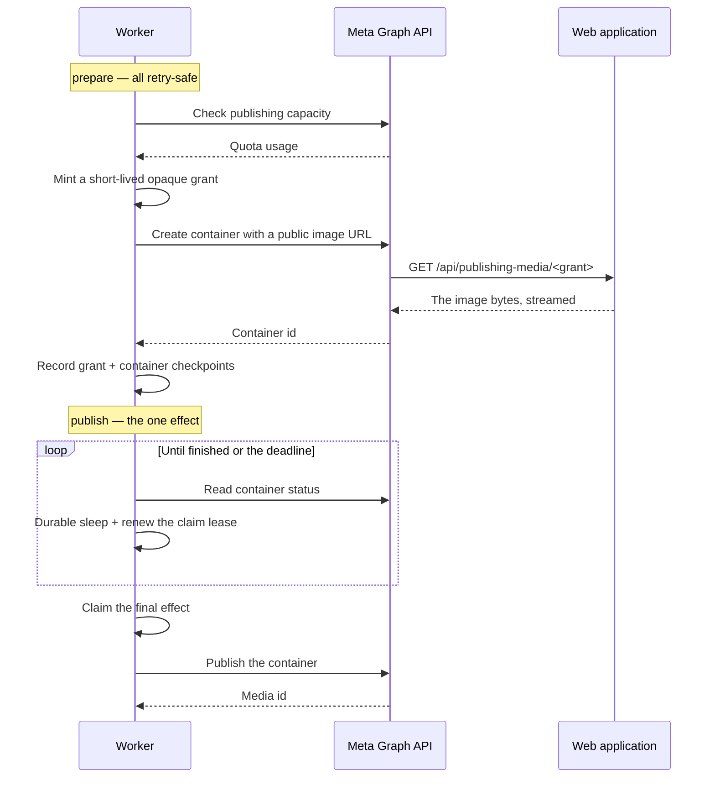

# Publishing

Getting an approved draft onto a platform, and knowing afterwards whether it
actually landed.

This is the most carefully built part of the system, for one reason: a publish is
the only operation here that cannot be undone. A duplicate post is visible to the
brand's audience, and a phantom post — one the system believes went out but did
not — is worse, because nobody goes looking for it.

## The rule everything follows from

**A network call that times out has not failed.** It has an unknown outcome.

Treating it as a failure and retrying produces a duplicate. Treating it as a
success produces a phantom. So the system records exactly what it knows, and
resolves it later against evidence.

## The publisher port

Every platform adapter implements three methods, and the split *is* the design:

| Method | Property |
|---|---|
| `prepare` | Everything that can be retried freely — validation, media upload, container creation |
| `publish` | The **one** final, non-idempotent provider effect |
| `reconcile` | Read-only. Did that final effect actually land? |

Anything expensive or slow belongs in `prepare`, where a retry is harmless.
`publish` is deliberately as small as it can be, because it is the only part with
an irreversible consequence.

Before `publish` performs its effect, it takes a **final-effect claim**. If the
claim is refused — because another attempt already took it — the adapter returns
an unknown-delivery result rather than sending. That is what makes a retry safe
in the window where a previous attempt might still be in flight.

## Classifying a failure

A provider failure is not a message. It is five fields, and each answers a
different operational question:

| Field | Question | Values |
|---|---|---|
| `class` | What kind of problem? | invalid, auth, rate, transport, timeout, provider, permanent |
| `effectScope` | Before or during the final effect? | preparation, publication |
| `certainty` | What do we actually know? | definite, preparation unknown, delivery unknown |
| `next` | What should happen? | none, retry preparation, retry after the provider's time, reconcile first, operator repair |
| `code` | A stable identifier | Per-platform, from the shared contracts |

The constructors enforce the correlation rather than trusting the caller. A
failure marked *delivery unknown* is automatically scoped to the publication and
automatically routed to *reconcile first*.

**An ambiguous delivery can therefore never be auto-retried.** That is not a
convention someone might forget; it is structurally unreachable.

## Retry policy

Bounded automatic attempts, then a hand-off to a human. At the limit the failure
is rewritten to *operator repair* with no retry time — it stops, visibly, rather
than backing off forever into silence.

Backoff is exponential, clamped to a floor and a ceiling, and the provider's own
`Retry-After` is preferred over our calculation whenever it is supplied. If a
platform tells us when to come back, arguing with it is how rate limits become
bans.

## Provider calls are hardened

Every adapter is handed a wrapped fetch, not the raw one:

- **Redirects are refused outright.** A publishing credential never follows a
  redirect — that is how a credential ends up on a host you did not intend to
  send it to.
- **Layered abort signals** combine the caller's signal, a per-request timeout
  and an internal controller. Media uploads get a longer budget than API calls.
- **Response size is bounded twice** — a declared-length pre-check and a streaming
  byte counter that aborts past the cap, regardless of what the header claimed.

## The three platforms

### Telegram

The simplest, because it has no pre-effect state. `prepare` validates and
assembles; there are no checkpoints to record.

The canonical source link is carried as a **message entity** with an offset,
length and URL, rather than as markup embedded in the text. Injecting markup into
a caption assembled from generated content is how a stray character breaks a post
or, worse, changes what it links to.

A `2xx` response without a message identifier is treated as *delivery unknown*,
not success. And `reconcile` always returns *still unknown* — Telegram exposes no
way for a bot to look up a message it may have sent. That is an honest limitation,
recorded rather than papered over: those cases resolve through an operator
attestation instead.

### X

OAuth 1.0a request signing, implemented against the specification including the
strict percent-encoding rules that catch most naive implementations.

`prepare` looks for an existing **media checkpoint first** and reuses it. A retry
never re-uploads the image and never pays for it twice.

`reconcile` is the interesting part. With a post checkpoint, delivery is
immediate. Without one, it reads the account's recent posts and looks for a
candidate that matches the assembled text **exactly**, was created at or after the
ambiguous attempt began, and is the **only** such match. Zero matches or two
matches both resolve to *still unknown*.

That is deliberately conservative. A fuzzy match here would confidently mark the
wrong post as ours.

The timeline read is also all-or-nothing: a malformed entry fails the whole read
rather than being skipped, because a partially parsed timeline could hide the
very post being looked for.

### Instagram

The most involved, because Instagram publishes through a container workflow and
cannot publish text alone.

Several details are load-bearing:

- **The Graph origin is pinned**, and every constructed URL is re-checked against
  it, so a path value taken from data can never escape to another host.
- **The grant is why the browser and Meta never touch object storage.** Meta must
  fetch the image over HTTPS from somewhere. Rather than a presigned storage URL,
  the worker mints a short-lived opaque capability tied to that publishing
  operation, and the web application streams exactly one verified asset for it —
  no object key, no redirect, no cacheable response.
- **Polling uses durable sleeps and renews the lease** on each pass, so a
  container that takes minutes to process does not lose its claim mid-wait.
- **The deadline is computed once inside a step**, so a replay cannot extend it.
- **A container already `PUBLISHED` resolves as confirmed** using the container
  identifier. That is idempotent recovery: if the effect landed and we lost the
  answer, re-reading finds it.

## Reconciliation

When a publication is left in *delivery unknown*, a separate reconciliation
operation resolves it.

The design decision worth understanding: reconciliation runs against a
**deliberately crippled runtime**. Claiming the final effect throws. Reading media
throws. Minting a grant throws.

So a reconciliation *cannot* publish, even if a future adapter change tried to.
The capability is removed rather than the discipline being relied on.

Before it runs, hard guards check that the publication is genuinely unresolved,
that its unresolved attempt is the one being reconciled, that provider evidence
exists (X excepted — its evidence *is* the timeline), and that the destination
still exists in the customer template.

Three outcomes:

- **Delivered** — recorded with provider authority, under optimistic concurrency,
  with an idempotency key and a request hash so a replay is recognised as a
  replay.
- **Not delivered** — recorded the same way. The draft can be republished.
- **Still unknown** — recorded as still unknown. The ambiguity is *preserved*, not
  guessed at, and it surfaces to the operator for attestation.

That third outcome is the one that matters. A system that always produces a
decision produces wrong decisions.

## The outbox relay

Every durable operation reaches the worker through a transactional outbox. The
intent and the work item are written in the same transaction as the state change,
so they cannot diverge.

The relay claims rows under a lease attributable to one live worker process,
dispatches them, and marks them. Three properties:

**Exactly-once function runs from at-least-once delivery.** Each dispatched event
carries an identifier derived from the outbox row, which the execution service
uses as an idempotency key. Relaying the same row twice produces one run.

**A malformed row is terminal, not retried.** A schema or payload error fails
immediately rather than consuming the full retry budget on something that will
never parse.

**A batch collapses into one notification per audience.** Five events for one
operator produce one live update, not five.

Beyond dispatch the relay runs three repair passes on a scan interval:

- **Stranded publication recovery** — publications that lost their claim.
- **Follow-up repair** — the case where the *effect succeeded* but the bookkeeping
  after it did not: the activity record, or the cache notification. Both are
  retried with idempotency keys, so the repair cannot double-write.
- **Market catalogue refresh**, when the installation enables the market
  capability, with its own adaptive re-check interval.

The loop never dies. Any thrown error logs a stable code and sleeps.

When a row does exhaust its attempts, the operator interface shows it as a stuck
dispatch, and a re-arm command puts exactly one exhausted event back — refusing
to run if it does not find exactly one, or if the row changed underneath it.

## Scheduling

A scheduled publication sleeps durably **without holding the effect claim**, and
claims only after it wakes. Holding a claim across a sleep of hours would block
every other path that needs it and would survive a restart as a stuck lock.

A schedule can be cancelled, rescheduled, or found **missed** — and a missed
schedule requires operator confirmation rather than firing late on its own. A
post that was meant to go out during a market event is often not one you want
published six hours afterwards.

An emergency pause is available as an environment variable, checked inside the
publish effect. It is a brake an operator can pull without a deployment.

## Where the code is

| Concern | Path |
|---|---|
| The port and failure classification | `apps/worker/src/publishing/port.ts` |
| Factory and hardened fetch | `apps/worker/src/publishing/factory.ts` |
| Platform adapters | `apps/worker/src/publishing/telegram.ts`, `x.ts`, `instagram.ts` |
| Reconciliation driver | `apps/worker/src/publishing/reconcile.ts` |
| Outbox relay | `apps/worker/src/relay/` |
| Durable functions | `apps/worker/src/inngest/publishing.ts`, `publishing-effect.ts` |
| Shared payload assembly | `packages/contracts/src/editorial.ts` |
| Operator screens | `apps/web/src/features/publishing/` |

Payload assembly is shared: the publishing ticket in the interface and all three
adapters import the same assembler, so what an operator previews is what gets
sent.
