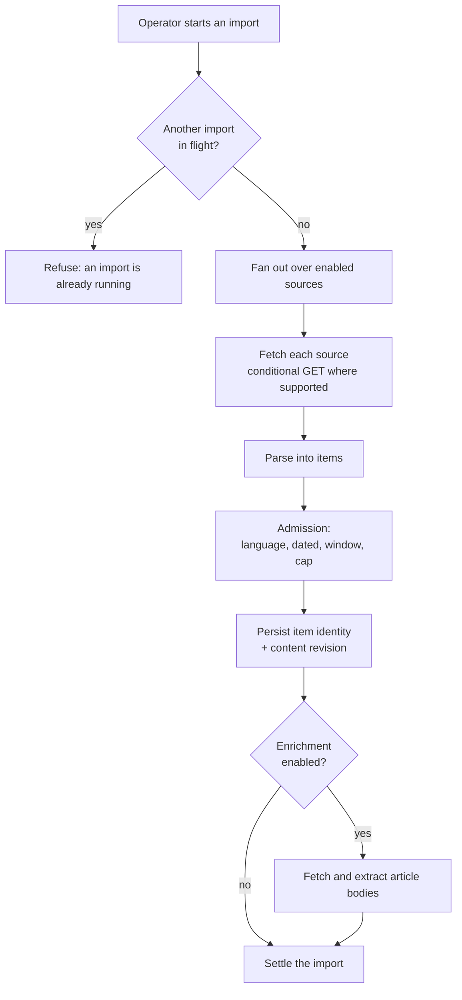
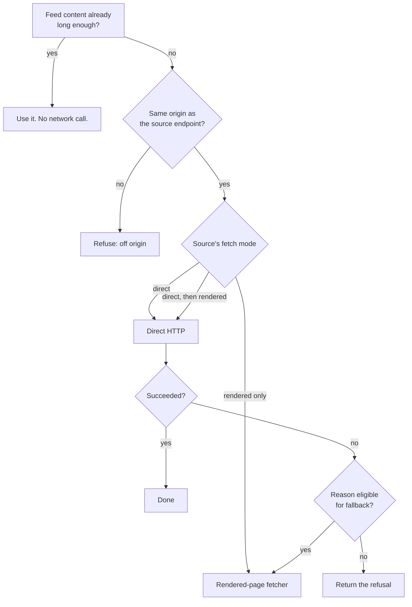

# Source ingestion

Getting items out of the configured sources, and article bodies out of the pages
behind them. Everything here runs in `apps/worker`, and every outbound request
goes through one guard.

## The shape of an import

At most one import may be in flight per installation. That is enforced by a
partial unique index on the import table rather than by application logic, so two
concurrent requests cannot both win — the second gets a clean domain error rather
than a duplicate run.

## Source kinds

Two today, each an adapter behind one port. Callers never learn which adapter
ran; they get a structured result.

### RSS and Atom feeds

Parsed with a real XML parser, never a regular expression. Both dialects are
supported from the same adapter — RSS items and Atom entries, RSS `channel`
language and the Atom `xml:lang` attribute.

Some specifics that matter in practice:

- **Conditional requests.** The stored entity tag is sent as `If-None-Match`, or
  the stored modification date as `If-Modified-Since`. A `304` settles the source
  as *not modified* with no items and no further work.
- **Identity.** The item's external identifier is its GUID, falling back to the
  Atom identifier, falling back to the canonical URL.
- **Summary selection** takes the *longest* of the available content fields rather
  than the first, because feeds disagree about which one carries the real text.
- **Date selection** walks the publication date, the Dublin Core date, the Atom
  published date, and finally the Atom updated date.
- **Language admission.** A feed that declares no language is admitted. One that
  declares a language must match the source's content locale, or its items are
  admitted as *skipped for language*. An item with no date is *skipped as
  undated* regardless.

Failure is graded rather than binary. A feed that parses but is empty settles as
*skipped* with reason *empty feed*. One that will not parse settles as *rejected*
with *parse failure*. One where some entries lack an identity settles as
*partial* — and the valid items still flow through.

#### Defending against hostile XML

A feed is an untrusted document from a third party, and XML has a long history of
entity-expansion and external-entity attacks. Three things are done about it:

1. Entity processing is bounded on every axis the parser exposes — entity count,
   entity size, expanded length, expansion depth, and total expansions.
2. Tag and attribute values are not coerced to other types.
3. The parser in use has no switch to reject a document type declaration, so the
   adapter refuses any document whose prolog — the text before the first element
   — contains one. That gate plus the bounds is the defence.

### Public Telegram channels

Read from the public web preview page. No Telegram API and no token is involved,
which is why a public channel can be a source without being a destination.

The channel handle is validated against a strict grammar *before* any network
call, so a malformed handle costs nothing. A response that redirects away from
the preview path settles as *rejected* with *no web preview* — that is what
happens for groups and channels that do not have one. Markup the adapter cannot
read settles as *partial* with *markup drift*, which is the honest description:
the page changed shape, and someone needs to look.

Unlike a feed, the preview page is chronological, so the adapter takes the *last*
N message blocks rather than the first.

## Content identity and revisions

An item's identity is `(source, external identifier)`. Its content is stored as
revisions, hashed over the title, summary, canonical URL and content locale.

View counts are deliberately excluded from that hash. A Telegram post whose only
change is that more people saw it is not new content, and hashing the view
counter would create a fresh revision on every single import.

A unique constraint on `(item, content hash)` means an unchanged refetch is a
no-op rather than a duplicate row.

## Article enrichment

A feed summary is often a teaser. Enrichment fetches the page behind the item and
extracts its body.

The decision order is deliberately cheap-first:

**Only three reasons are eligible for fallback**: an anti-bot challenge,
insufficient extraction, and a page that requires JavaScript. Security and policy
refusals — a blocked address, an off-origin URL — are never retried through the
third-party fetcher. Otherwise the fetcher would become a way to launder a
refusal.

**The same-origin rule** requires the article URL's origin to equal the source
endpoint's origin, with no credentials in the URL: no other host, no non-standard
port, nothing borrowed. A feed cannot point the fetcher at an arbitrary target.

### Extraction

Paragraph text, collected with a real HTML parser, skipping the containers that
carry navigation and boilerplate — asides, figures, footers, forms, headers,
navs, `noscript`, scripts, styles and templates — and keeping only paragraphs
above a minimum length.

The extraction runs **twice**: once over the whole document and once scoped to the
first `<article>` element, and the denser result by character count wins. That is
not over-engineering; real publishers disagree. Some have no `<article>` at all,
and others put a thin excerpt inside one while the real body sits outside it.

### Grading the outcome

A short extraction is not simply a failure. If the raw HTML asks the reader to
enable JavaScript, the reason is *JavaScript required*. Otherwise it is
*extraction insufficient*. HTTP `401`, `403` and `429` are recorded as an
*anti-bot challenge* rather than as a generic failure, because that is what they
almost always are and it is what tells an operator to change the source's fetch
mode.

There is a deliberate limit here worth knowing: the enrichment reason vocabulary
has no member for a provider-account problem. An expired third-party key, an
exhausted credit balance and a rate limit all settle the same way and separate
only in the log.

## The outbound request guard

Every untrusted outbound fetch in the worker — sources, article pages, market
data — goes through one function. There is no way around it and, in production,
no exemption list.

| Control | What it does |
|---|---|
| **Protocol allowlist** | Only `http:` and `https:`. Everything else is refused before a socket opens. |
| **No credentialed URLs** | A URL carrying a username or password is refused. |
| **No non-default ports** | A non-default port is refused outright. |
| **Address blocklist** | Loopback, private, link-local, carrier-grade NAT, documentation, benchmarking, multicast and reserved ranges, in both IPv4 and IPv6. An address that will not parse is treated as blocked. |
| **DNS pinning** | The connection's DNS lookup is the security check. Every resolved address is validated, and the connection uses that same resolution — which is what closes DNS rebinding, where a name resolves safely for the check and hostilely for the connection. |
| **Redirect validation** | Manual redirects with a hop budget. Every hop re-runs the full URL policy and re-validates DNS. An HTTPS-to-HTTP downgrade is refused. Depending on the caller's policy, any redirect or any cross-origin redirect can be refused outright. |
| **Deadlines** | Connect, headers and body timeouts, plus one abort signal covering the entire redirect chain — so five slow hops cannot each get the full budget. |
| **Size caps** | Enforced three times: by the HTTP client, by a `Content-Length` pre-check, and by a streaming byte counter that cancels the moment the running total exceeds the cap. A lying `Content-Length` does not get you past the third. |
| **Content-type allowlist** | Per caller. A feed fetch accepts XML types; an article fetch accepts HTML. |
| **Declared charset is honoured** | The response decodes as the charset it declared, or it is refused. Silently falling back to UTF-8 would corrupt every legacy-encoded source rather than surfacing one clear failure. |

`429` and `503` are lifted into a distinct *retry after* failure carrying the
parsed delay, from either the integer or HTTP-date form of the header.

Every refusal logs exactly the host and the outcome. No URL, no body, no provider
text.

### The one place the guard cannot apply

When a page is fetched through the third-party rendered-page service, the request
leaves from *their* infrastructure, so pinning our socket proves nothing about
theirs. That path therefore performs an explicit pre-flight instead: the URL
policy check, then a DNS resolution where **any** blocked address in the result
refuses the request. It is weaker than pinning — it cannot stop a rebind between
our check and their fetch — and it is applied precisely because the strong control
is unavailable there.

## Topic projection

An import carries the operator's topics. Those topics also need to exist in the
run's content locale, and that projection is validated hard: same cardinality,
same order, and the result must actually be in the requested script.

Currency amounts, percentages, URLs, handles, hashtags and tickers must survive
translation as a multiset. Localized digit glyphs and localized currency wording
are accepted — a Persian rendering of a dollar amount is correct, not a lost
token — but a token that simply vanished is a failure.

When translation is unavailable, the original topics are used and the record
carries an explicit *used original fallback* flag. The fallback is recorded, never
silent.

The translation prompt states plainly that the topic strings are untrusted data
and that instructions inside them must not be followed. Every translation prompt
in this codebase carries that sentence.

## Where the code is

| Concern | Path |
|---|---|
| Source port and factory | `apps/worker/src/sources/` |
| Feed adapter | `apps/worker/src/sources/rss-atom.ts` |
| Telegram preview adapter | `apps/worker/src/sources/telegram-public.ts` |
| Topic projection | `apps/worker/src/sources/effective-topics.ts` |
| Article port and factory | `apps/worker/src/articles/` |
| Direct fetch and extraction | `apps/worker/src/articles/direct-http.ts` |
| Rendered-page adapter | `apps/worker/src/articles/firecrawl.ts` |
| The outbound guard | `apps/worker/src/fetch/safe-http.ts` |

Related: [`editorial-pipeline.md`](editorial-pipeline.md) picks up where an import
settles.
