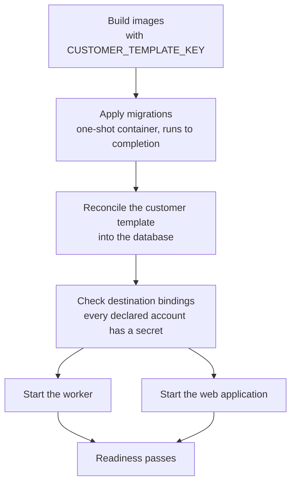

# Operations

Running ChainReporter, on a laptop or on a customer's server.

| Page | Covers |
|---|---|
| [Local development](local-development.md) | Getting a working machine from a fresh clone |
| [Environment variables](environment-variables.md) | Every variable, which process reads it, required or optional |
| [Deployment](deployment.md) | Images, Compose, the reverse proxy, and the startup order |
| [Database migrations](database-migrations.md) | Generating, reviewing and applying schema change |
| [Customer onboarding](customer-onboarding.md) | Standing up a new installation from scratch |
| [Runbooks](runbooks.md) | Backup, restore, rollback and incident response |

## What is different about operating this system

**One installation per customer.** There is no shared control plane and no
tenant switch. Everything on this page applies to exactly one customer's server.

**Configuration is data that must be applied.** A customer's brands, sources and
destination accounts live in a reviewed template directory. Nothing seeds
automatically at startup — an explicit reconcile step applies the template to the
database, and it is part of the deploy sequence rather than a side effect of
booting.

**Secrets are environment variables and nothing else.** No vault, no
database-stored credentials. Rotation means changing the variable and restarting
the process. Correspondingly, a *missing* secret has to be caught at startup: the
destination-binding checks exist so that an unbound account fails loudly at boot
rather than quietly at the first publish attempt.

**Two health signals, not one.** Liveness proves the process answers. Readiness
additionally proves the database is reachable within a bounded time *and* that
the template this process loaded matches the one applied to the database. A
process serving a different configuration than the database holds reports itself
unready.

**The worker is not optional.** The web application will render, but nothing will
be fetched, generated or published without it.

## The order that matters

Getting this wrong is the most common way a deployment goes sideways.

Migrations run to completion before any service starts. The template is applied
before bindings are checked, because the check reads the accounts the template
declared. Both applications assert at startup that they are running the template
the build embedded.

## Where things are

| | Path |
|---|---|
| Local stack | `docker-compose.yml` |
| Deployment material | `deploy/` |
| Per-installation examples, secret-free | `deploy/instance-examples/` |
| Environment examples | `.env.example`, `.env.migration.example`, `apps/*/.env.example`, `deploy/env-examples/` |
| Migrations | `packages/db/src/migrations/` |
| Customer templates | `customer-templates/` |

Live secrets belong in ignored environment files on the host. They are never
committed, never copied into an example, and never printed into a log.
