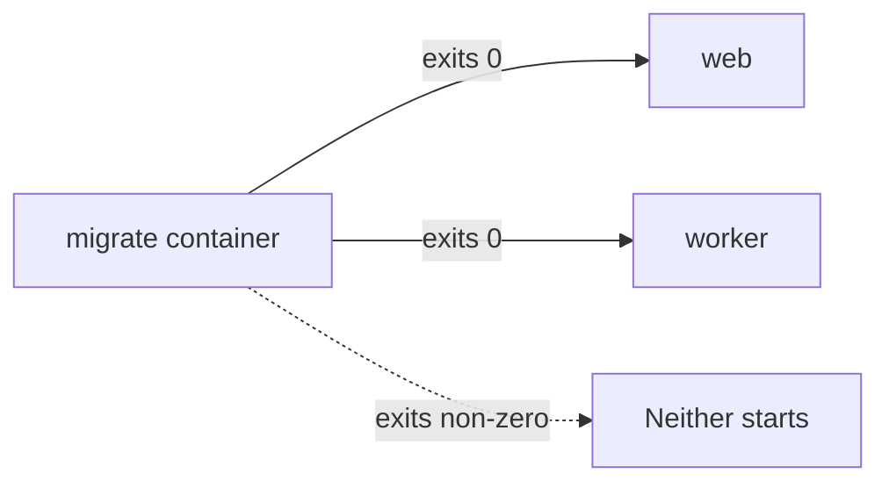

# Database migrations

Schema defined in TypeScript with Drizzle, applied to PostgreSQL as reviewed
forward SQL migrations.

## The normal workflow

```bash
# 1. Change the schema
$EDITOR packages/db/src/schema/<table>.ts

# 2. Generate the SQL
pnpm db:generate

# 3. Read the generated SQL. Every line of it.
$EDITOR packages/db/src/migrations/<generated>.sql

# 4. Apply it locally
pnpm db:migrate

# 5. Commit the schema change and the migration together
```

Step 3 is not optional. A generator produces plausible SQL, not correct SQL — it
cannot know that a column needs a backfill before it becomes `NOT NULL`, that an
index should be created concurrently, or that a rename it inferred is actually a
drop and an add. Read it as though a colleague wrote it.

## Three commands, and when each is right

| Command | Use it | Never use it |
|---|---|---|
| `pnpm db:generate` | To produce a migration from a schema change | — |
| `pnpm db:migrate` | Everywhere. This is what runs in every environment | — |
| `pnpm db:push` | On a local database you are willing to lose | Against anything with data you cannot recreate |

`db:push` diffs the schema and applies it directly, with no migration file and no
history. On a scratch local database that is genuinely useful while iterating on a
shape. Against a database with real rows it will happily drop a column to make
the shapes match.

The script is kept deliberately. The rule is about *where* it points, not about
the tool.

**Before any destructive operation** — `db:push`, a reset, a truncate, a volume
deletion — prove the target is disposable. Check the connection string you are
actually about to use, not the one you think is configured. If the database has
data you cannot recreate, the answer is a forward migration.

## Configuration

The migration tooling reads its connection string from a separate environment
file and a separate variable, validated by its own schema:

| | Runtime | Migrations |
|---|---|---|
| Variable | `DATABASE_URL` | `MIGRATION_DATABASE_URL` |
| Source | The service environment | `.env.migration` |

They are separate so a deployed environment can give the migration identity the
elevated privileges it needs — creating tables, altering types — while the
application's runtime identity has only what it needs to read and write rows. In
local development they usually point at the same place; in a deployment they
should not.

Copy `.env.migration.example` to `.env.migration` and fill it in. Both are ignored
by git.

## How migrations run in a deployment

Migrations run as a **one-shot container** built from `packages/db/Dockerfile`.
It applies forward migrations and exits.

Both applications declare a dependency on that container having *completed
successfully*, so neither can start against an unmigrated schema. This is
ordering enforced by the orchestrator rather than by a startup script racing
itself.



The migration image is built with the customer template key, and the build fails
with an explicit message if the key is missing — an empty key would otherwise
cause the build to pull in every customer's template directory.

## Writing a safe migration

The application is deployed by rolling images, so for a period the old code and
the new schema are both live. Migrations must therefore be **backward compatible
with the currently running code**.

The pattern that works:

1. **Add** the new column as nullable, or with a default. Deploy.
2. **Backfill** it. Deploy the code that writes both old and new.
3. **Constrain** it — `NOT NULL`, a unique index — once the backfill is complete
   and nothing writes the old shape.
4. **Remove** the old column in a later migration, once no running code reads it.

Four steps, four migrations, and no window in which a running process hits a
constraint it does not know about.

Things to be careful with:

- **`NOT NULL` on an existing column** rewrites the table and fails if any row is
  null. Add nullable, backfill, then constrain.
- **A unique index** on a large table locks writes while it builds. Consider
  building it concurrently, in its own migration.
- **Renaming** looks free but is not: it breaks running code that still uses the
  old name. Add, migrate reads and writes, then drop.
- **Dropping** anything is the last step of a sequence, never the first.

## Schema conventions

Read these before adding a table, because the error handling depends on them.

**Primary keys** are time-ordered UUIDs generated by the database. Time ordering
matters: it keeps index inserts local rather than scattering them across the
B-tree the way random UUIDs do.

**Every customer-owned table carries `workspace_id`**, with an explicitly named
foreign key. It identifies the installation.

**Foreign keys are named explicitly** rather than declared inline. This is not
style. The error classifier reads constraint names out of the driver's error to
turn a database error into a domain outcome — a foreign-key violation on a
`fk_`-prefixed constraint becomes a "not found" result, and specific unique
constraints map to specific domain errors. An unnamed constraint gets a
generated name the classifier cannot recognise.

**Timestamps are timezone-aware**, with `created_at` and `updated_at` on almost
every table.

**Soft delete** is available where an entity is retired rather than removed, and
it pairs with a filter helper so a query cannot forget it.

**Business rules live in the schema where they can.** The single-in-flight-import
rule is a partial unique index, not application logic. Two concurrent requests
cannot both win a race the database is arbitrating.

## Where things are

| | Path |
|---|---|
| Schema | `packages/db/src/schema/` |
| Migrations and journal | `packages/db/src/migrations/` |
| Migration runner | `packages/db/src/migrate.ts` |
| Drizzle configuration | `packages/db/drizzle.config.ts` |
| Repositories | `packages/db/src/repositories/` |
| Error classification | `packages/db/src/db-error.ts` |

The full table inventory is in
[`../domain/data-model.md`](../domain/data-model.md).

## Applying a customer template is not a migration

Migrations change the *shape* of the database. Applying a customer template
writes *rows* — brands, sources, destination accounts.

```bash
pnpm template:reconcile           # apply
pnpm template:reconcile --check   # compare without writing
```

No startup path ever seeds. The reconcile command is the only writer, it runs
after migrations and before the applications start, and `--check` is what belongs
in a verification step.
