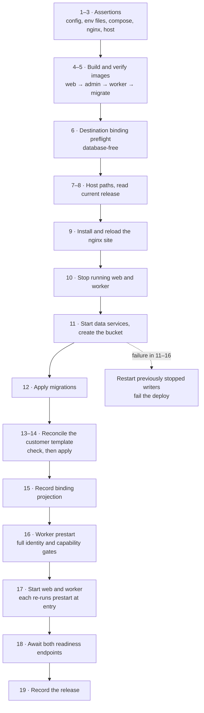
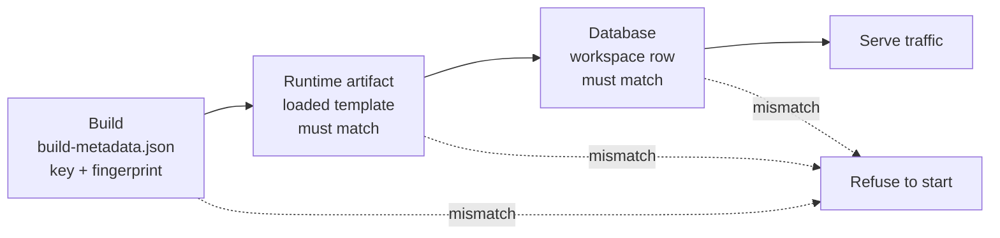

# Deployment

One installation, one host. Everything below is driven by `deploy.sh` at the
repository root, and every command it accepts requires an explicit instance
configuration — no mutation can fall back to another customer's deployment.

```
deploy.sh check <config>                             validate without changing anything
deploy.sh deploy <config>                            build from this source tree, then release
deploy.sh deploy-prebuilt <config>                   release images already on the host
deploy.sh rollback <previous-version> <config>       re-point at an older version
deploy.sh render-nginx <config>                      print the rendered site to stdout
```

## What an installation consists of

| Piece | Image | Notes |
|---|---|---|
| `web` | `<prefix>/web:<version>` | Next.js standalone server, non-root, port 3001 |
| `worker` | `<prefix>/worker:<version>` | Durable worker, non-root, health port 3002 |
| `db-ops` | `<prefix>/db-ops:<version>` | One-shot; serves both `migrate` and `reconcile` |
| `web-admin` | `<prefix>/web-admin:<version>` | One-shot; the operator-account commands |
| `postgres` | `postgres:18` | Memory-limited, no published port |
| `minio` | Pinned release | Memory-limited, loopback only |

Everything publishes on `127.0.0.1`. The deploy script actively greps the rendered
Compose output and refuses a `0.0.0.0` binding, so a public bind cannot ship by
accident. It also refuses fixed container names, so two installations can share a
host without colliding.

## Instance configuration

One file per installation, sourced by the script. It carries public identity and
paths — never credentials.

| Group | Keys |
|---|---|
| Identity | `COMPOSE_PROJECT_NAME`, `APP_VERSION`, `CUSTOMER_TEMPLATE_KEY`, `IMAGE_PREFIX` |
| Paths | `APP_ROOT`, `APP_USER`, `ENV_DIR`, `BUILD_SECRET_FILE` |
| Network | `PUBLIC_HOST`, `PUBLIC_IP`, and four distinct loopback ports |
| TLS and proxy | `TLS_CERTIFICATE`, `TLS_CERTIFICATE_KEY`, `NGINX_SITE_AVAILABLE`, `NGINX_SITE_ENABLED` |
| Guard | `MIN_FREE_MEMORY_MB` |

Tracked, secret-free examples live in `deploy/instance-examples/<hostname-or-ip>/` and
`deploy/production.env.example`. The real per-host configuration is not tracked.

`APP_VERSION` must be an **immutable tag**. The script rejects `dev`, `latest`,
empty, anything containing a placeholder marker, and anything outside a strict
character set. A mutable tag would make "which version is running" unanswerable —
and it would make rollback meaningless.

## The environment-file contract

Seven files live in `ENV_DIR`, each mode `600`:

`postgres.env`, `minio.env`, `migrate.env`, `reconcile.env`, `web.env`,
`worker.env`, `build.env`

Before anything runs, the script asserts a long list of properties about them.
This is the most valuable part of the deploy script, so it is worth reading in
full.

**Identity separation.** `migrate.env` must define the migration connection
string and must *not* define the runtime one. `reconcile.env`, `web.env` and
`worker.env` must define the runtime one and must *not* define the migration one.
A file cannot accidentally hand DDL privileges to a runtime process.

**Role separation.** `postgres.env` must define three *distinct* roles: the
bootstrap superuser, the migration role and the application role. The migration
connection string must use the migration role; every runtime connection string
must use the application role.

**Required keys per file.** The web environment must carry its model provider key,
the authentication secret, the cache-invalidation secret, the allowed origin and
the object-storage endpoint and secret. The build environment must carry the
server-actions encryption key. The worker environment must carry both durable
execution keys.

**Forbidden keys.** The development-mode durable flag is refused in both the web
and worker environments — that flag in production would silently switch the SDK
out of cloud mode. The error-reporting upload token is refused in both runtime
environments; it belongs to the build, not the running process. The on-host model
URL is refused in the web environment, because the web application does not serve
that backend.

**Cross-file agreement.** Values that *must* be identical are compared, not
assumed: the object-storage user, secret and bucket across storage, web and
worker; the cache-invalidation secret across web, worker and reconcile; the
durable signing key across web and worker; the server-actions encryption key
across build and web; the model provider key across web and
worker.

Every one of these checks exists because the corresponding mismatch is a real
failure that would otherwise appear hours later as a confusing symptom rather
than immediately as a refused deploy.

**No file may contain a leftover placeholder value.** That check has caught more
bad deployments than any other.

## Host assertions

- Running as root, with `nginx`, `curl`, `install`, `id`, `stat`, `getent` and
  `useradd` available.
- Both TLS files exist.
- Every file in the environment directory is mode `600`.
- Available memory is above the configured floor.
- `PUBLIC_HOST` equals `PUBLIC_IP` for a literal IPv4 origin, or resolves to it
  for a hostname. Literal addresses do not require reverse DNS.

There is also a **legacy-collision guard**: the script refuses an application root
that is, or sits under, one of the retired estate's paths; refuses a project name
matching a retired service; and refuses the ports the retired stack used. On a
host that once ran the previous system, that guard is what prevents a deploy from
overwriting it.

## The deploy sequence

Nineteen steps, in this order. The ordering is the load-bearing part.



Three ordering decisions are worth calling out.

**Binding preflight runs before the database is needed.** It is deliberately
database-free, so a missing destination credential fails at step 6 rather than
after the schema has already been migrated. An unbound destination exits with a
distinct code, and under `set -e` that aborts the deploy.

**Nginx is installed before the release is activated.** The site is rendered,
validated with `nginx -t` and reloaded while the previous release is still
serving. A bad template fails before anything stops.

**Writers are stopped, then restarted on failure.** Everything from starting the
data services through the worker prestart runs in a subshell. If any of it fails,
the previously running web and worker are started again and the deploy fails with
a specific code — so a failed deploy leaves the old version running rather than
leaving the host with nothing up.

## The identity chain

Three fingerprints must agree before any process serves traffic. This is what
makes "which configuration is this deployment actually running" a question with a
verified answer rather than an assumption.



1. **At build time**, the template is loaded and its key and fingerprint are
   written into the image as immutable metadata. Both applications do this.
2. **At startup**, the prestart gate reads that metadata, compares its key against
   the runtime environment, loads the template from the artifact by the runtime
   key, and compares fingerprints. A successful load proves the build key, the
   runtime key and the on-disk directory all agree.
3. **Against the database**, it reads the workspace rows. None means not
   provisioned. Two means something is very wrong — one deployment serves exactly
   one customer. A key or fingerprint mismatch means the template was not applied.

Both container entrypoints run this gate with `set -e`, so a failed check prevents
the application command from ever executing. And both readiness endpoints repeat
the applied-fingerprint check, so a *running* process drops out of rotation if the
database drifts underneath it.

Prestart exit codes are meaningful: **1** is a failure, **2** is specifically
"something is unbound".

Beyond identity, the worker's prestart also verifies that the object store is
bound, that the model capabilities the template selects are available, that the
rendered-page fetcher key is present if a source needs it, that market provider
bindings are satisfied, and that every declared destination account has its
credentials. The web application's prestart additionally requires the object
store and verifies that the assistant task routes to the remote backend — the web
process cannot serve a local one, so an incorrectly routed task must stop the
process rather than fail the operator's first question.

## Images

All three Dockerfiles share a shape: the pinned slim Node base image, pnpm via corepack,
manifests copied before sources so the dependency layer caches, and a build cache
mount on the package store.

**Exactly one customer's template ships in each image.** The template key is a
build argument, guarded by an explicit non-empty check with a clear failure
message — because an empty argument would turn the following copy into *every*
customer's template, which is the one thing an artifact must not contain.

**The web build takes its values from a BuildKit secret**, not a build argument
and not an image environment variable. Build arguments and environment variables
persist in image layers and are readable by anyone who can pull the image; a
secret mount does not. Without the mount, committed non-production placeholders
keep a local build working — they exist only to satisfy the build's environment
validation and never reach a running container.

The web image is built in four stages: the application build, an `admin` stage
carrying only the bundled operator commands, a `prestart` stage that builds the
identity gate as a standalone bundle, and the runner. The prestart bundle is
shipped into both runtime images so the gate can run without a workspace install.

The worker image installs font configuration and ships two fonts — a Latin face
and a Persian face — with recorded provenance and upstream licences. That pair is
what makes bilingual chart and poster rendering possible inside the container.

The database operations image is a short-lived one-shot with no entrypoint and no
non-root user, used by both the migration and reconcile services. It never
becomes a long-running process.

The build context excludes every dotfile, every build output and every environment
file except examples — with one deliberate exception, Markdown under
`customer-templates/`, because brand guidance and reviewed knowledge must ship.

## The reverse proxy

Rendered from a template with the public host, the loopback port, the TLS paths
and a per-installation zone prefix, so two installations on one host own distinct
rate-limit zones.

| Property | Value |
|---|---|
| Port 80 | ACME challenge files; permanent redirect to HTTPS for other requests |
| Port 443 | TLS, HTTP/2, IPv4 and IPv6 |
| Body limit | 32 MB, with a body timeout |
| Buffering | Off in both directions, so streaming responses stream |
| Real client IP | Taken from the forwarded header, trusting loopback only, non-recursive |

Routes, and why each is special:

| Location | Treatment |
|---|---|
| `/api/internal/` | **Returns 404.** The signed cache-invalidation route is unreachable from the internet. |
| `/api/health` | **Returns 404.** Health and readiness are loopback-only. |
| `/api/publishing-media/` | Proxied with **access logging off**, so media grant URLs never land in a log file. |
| `/api/auth/sign-in/email` | A strict rate-limit zone of its own. |
| `/api/chat` | The general zone, with a long read timeout for streaming. |
| `/` | The general zone. |

Nothing proxies the worker port, the database, or object storage — and the deploy
script greps the rendered site to prove it before installing.

### HTTPS without a domain

An installation may use its public IPv4 address as `PUBLIC_HOST`, with the same
address in `PUBLIC_IP`. Set the build and runtime public origins to
`https://<public-ip>` and provide a trusted certificate containing that IP address.
The certificate must exist before deployment; the script does not issue one.

For [Let's Encrypt IP certificates](https://letsencrypt.org/2026/03/11/shorter-certs-certbot),
use Certbot with IP-address webroot support, `--ip-address <public-ip>` and
`--preferred-profile shortlived`. Before the first certificate request, create
`/var/www/letsencrypt` and configure an HTTP-only bootstrap site to serve
`/.well-known/acme-challenge/` from it. Keep public port 80 reachable. Request the
certificate with `certonly --webroot --webroot-path /var/www/letsencrypt`, then
point the deployment's TLS paths at its `fullchain.pem` and `privkey.pem`.
The deployed site preserves that challenge path for subsequent renewals.

These certificates last only 160 hours, so automatic renewal is required. Verify
the Certbot timer checks at least twice daily and configure a successful-renewal
deploy hook to run `nginx -t && systemctl reload nginx`. Verify the complete path
with `certbot renew --dry-run --run-deploy-hooks`; a renewed file alone does not
make Nginx load the new certificate. See the
[Certbot renewal guide](https://eff-certbot.readthedocs.io/en/stable/using.html#renewing-certificates).

## Database roles

On a first initialisation of an empty data directory, a script creates three
identities:

| Identity | Owns |
|---|---|
| Bootstrap superuser | Initial setup only |
| Migration role | The database and the `public` schema. Runs DDL. |
| Application role | Data access only. No DDL, no `PUBLIC` grants. |

Default privileges are granted from the migration role to the application role, so
tables created by later migrations are automatically usable without another grant.

**This split is production-only.** The local Compose file uses the superuser for
everything and mounts no initialisation directory, so a local box does not model
it. The non-container example environment files do model it, but nothing tracked
creates those roles locally.

## Rollback

```bash
./deploy.sh rollback <previous-app-version> <config>
```

Rollback re-points the installation at an older image tag. It runs the same static
assertions, host assertions, image checks and binding preflight, then:

1. Reconcile check.
2. Reconcile apply — **only if divergent**.
3. Worker prestart.

**There is no migration step.** Schema is forward-only. A rollback verifies that
the older application's template identity is still valid against the *current*
schema, which is exactly why migrations must be backward compatible with the
running code — see
[`database-migrations.md`](database-migrations.md).

The target version's images must already be on the host; the image check enforces
that before anything stops.

## Release records

After a successful activation the script reads the build metadata out of the
image itself and writes a release manifest under the application root, recording
the version, the previous version, all four image references and the embedded
build metadata. A `current-release` pointer names the active version.

Both files are written atomically through a temporary file, owned by the
application user with restrictive permissions. The pointer is validated on the
next deploy — a manifest that does not exist fails the release-pointer check.

## Operator accounts

There is no public signup. Accounts are created manually, and no tracked script
ever invokes the admin service — it is a deliberate human step.

```bash
compose run --rm admin        # with OPERATOR_EMAIL and OPERATOR_NAME set
```

Passwords are **never** read from arguments or environment variables. The command
refuses to run without an interactive terminal and mutes the input stream so
keystrokes do not echo — because both arguments and environment variables persist
in shell history and in the process list on the customer's machine.

## What is not scripted

Stated plainly so nobody assumes otherwise:

- **There is no restore command.** The backup script creates and rehearses; a
  production restore is a manual procedure. See
  [`runbooks.md`](runbooks.md).
- **Backup retention and scheduling are not in the repository.** They are host
  configuration.
- **There is no continuous-integration configuration tracked here.** `pnpm
  validate` is the single "everything passes" gate, and it is run by a person.
